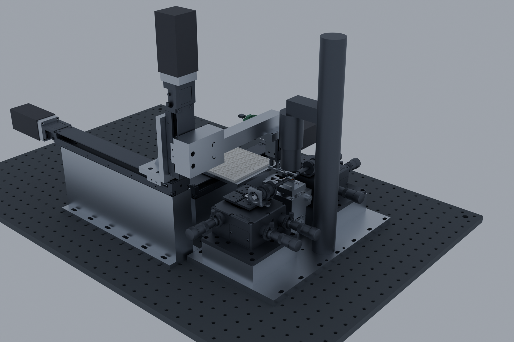
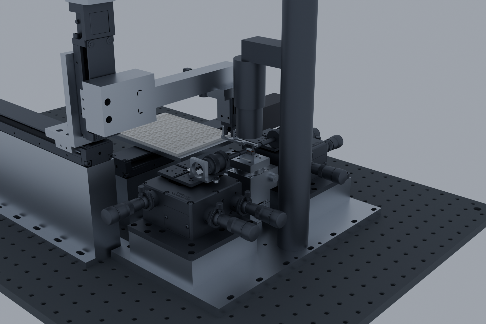

# Blender: the station as a renderable, animated 3D model

This folder turns the station assembly into a Blender scene and animates one die exchange on it.
It is **downstream of the CAD, not a CAD component**: nothing here defines geometry, and
`cad/build.py` does not know about it. **Before editing anything here, read
[BLUEPRINT.md](BLUEPRINT.md)** — the rules come from bugs that already shipped.

Owned by the 3D-viz agent (CLAUDE.md §5). The inputs are
[`../station/STEP/station_assembly.step.zip`](../station/STEP/) — the transport at the nest — and,
for the worst-case pose, `station_far_column.step`. Nothing here reads the models themselves; the
member-name prefixes in [`../station/README.md`](../station/README.md) ("Assembly member names") are
the interface, and collections and materials key on those prefixes, never on an exact member list.




## Why this route

`cad/station/model.py` builds the station as one flat `cq.Assembly`: every member is added with its
own `name=` and `color=`, already placed in the station frame. The STEP therefore already carries a
named, coloured part tree — 84 members with the manufacturer geometry in place — so nothing has to
be re-modelled or re-derived here. Blender cannot read STEP, so the geometry is tessellated once
with OpenCASCADE (the `cascadio` wheel) into a GLB, which keeps that same tree, and Blender imports
the GLB natively. **CadQuery is not needed to work in this folder.**

## Pipeline

```bash
# 1. STEP -> GLB (about 35 s; needs network the first time, for the cascadio wheel)
UV_SYSTEM_CERTS=1 uv run --with cascadio --with numpy --with trimesh --python 3.12 --no-project \
    python cad/blender/step_to_glb.py

# 2. GLB -> scene + stills
"C:/Program Files/Blender Foundation/Blender 5.2/blender.exe" --background \
    --python cad/blender/build_scene.py -- --render iso plan side front nest

# 3. scene -> animated scene
"C:/Program Files/Blender Foundation/Blender 5.2/blender.exe" --background     --python cad/blender/animate_exchange.py

# 4. check it before spending an hour rendering (exits non-zero on failure)
"C:/Program Files/Blender Foundation/Blender 5.2/blender.exe" --background     --python cad/blender/verify_scene.py

# 5. preview video
"C:/Program Files/Blender Foundation/Blender 5.2/blender.exe" --background \
    --python cad/blender/animate_exchange.py -- --preview --camera iso
```

`UV_SYSTEM_CERTS=1` is required on the NTT network: without it uv rejects the intercepting proxy
with `invalid peer certificate: UnknownIssuer`.

The preview renders in **Cycles** by default, at 48 samples with denoising: about 5 s a frame on an
RTX 2000 Ada over OptiX, so roughly an hour for the 682-frame cycle. `--engine eevee` is the fast
draft, but shallow features — the tray's 0.4 mm pocket ledges above all — come out as flat surface
there. The script switches EEVEE's ray tracing and shadows on, which helps, but it is still no
match for Cycles at this scale: use eevee to check motion, cycles for anything anyone else sees.

| File | What it does |
|---|---|
| `step_to_glb.py` | tessellates the assembly STEP at 0.05 mm linear / 0.2 rad angular deflection and writes `station_assembly.glb`; prints part count and bounding box for checking |
| `build_scene.py` | imports the GLB, sorts the parts into collections, assigns materials, adds lighting and five cameras, saves `die_tester_station.blend`, optionally renders stills |
| `animate_exchange.py` | rigs the moving groups onto empties, keyframes the 14-step exchange, saves `die_tester_station_animated.blend`, optionally renders an mp4 |
| `HANDOFF.md` | questions from the 3D-viz agent to the designer agent; written only here, answered in `cad/station/HANDOFF.md` or in a commit message |
| `members.json` | the member names of the assembly these outputs were built from, so a rename or an added member appears as a reviewable diff instead of a part that silently stops moving |
| `source.json` | the sha256 of the assembly zip the outputs were built from, plus a timestamp; `step_to_glb.py` writes it and `cad/build.py --check` reads it, so a scene left behind the station is visible rather than silent |
| `verify_scene.py` | checks the animated scene against the static one — inventory, per-axis placement, die seating, contact band, loop closure — and exits non-zero if anything is off |

`station_assembly.glb` and both `.blend` files are git-ignored (35 MB and 29 MB each); the scripts,
this README and `renders/` are tracked. Re-run the three steps to get them back.

## What ends up in the scene

**70 parts, from 71 members.** The one dropped is `objective_keepout`, a clearance volume the
station model draws as a render aid rather than a part of the machine (`camera_fov` is dropped the
same way when present).

The worst-case pose — the X carriage, tower, arm, gripper and camera at the farthest tray column —
used to be a second solid copy inside this assembly and is now its own file,
`station_far_column.step`. So the `*_at_far_col` strip in `build_scene.py` normally matches nothing.
It is kept deliberately: that suffix is how those members are named, so converting the far-column
file and pointing `--glb` at it still gives one machine instead of two overlaid.

**Collections** follow the assembly member names: Table, Nest, Fibers, Microscope, Tray, X axis,
Y axis, Z tower, Arm, Gripper, Tray camera.

**Materials** are chosen from the part name, which already encodes the material by the repo's
suffix convention (`_6061`, `_copper`, `_semitron`, `_steel`); the vendor parts get the finish they
actually have (black-anodized bodies, stepper cans, the SLA tray, the copper chuck, the TFLN die
and the fiber tips with a little transmission). Order matters in `MATERIAL_RULES`: `fiber_in` and
`fiber_out` are the fiber tips and must be matched before the fiber *hardware* — the HCS013 mount,
HFR001 rotator, HFC005 chuck and AMA010/M cleats — or the holders come out looking like glass.

The optical table is the Thorlabs MB6090/M breadboard, 864 holes, which is most of the jump from
1.1 M to 1.8 M triangles. It is worth it at these camera distances; if it ever costs too much,
replace that one member with a slab rather than coarsening the whole tessellation.

**Cameras.** `cam_iso`, `cam_plan`, `cam_side` (along +Y, the optical axis) and `cam_front` (along
+X, the die long axis) match the `cadgen` renders in `cad/station/renders/`; `cam_nest` is the
close-up on the exchange. All are framed on the machine rather than on the 940 × 560 mm optical
table, so the table is cropped at the edges.

`animate_exchange.py` adds a sixth, `cam_orbit`, which circles the station once over the cycle and
finishes behind it — `--orbit` sets the turn in degrees (180 by default, negative to go the other
way round). It hangs off a pivot empty standing on the machine's centroid, at (−60, −20, 1.5) mm,
essentially the die plane between the nest and the tray, so turning the pivot about Z swings the
camera while it keeps looking at the same point. Elevation and lens come from `cam_iso`. The radius
is the largest of the distances needed at 24 azimuths around the circle — 1502 mm — so the machine
never leaves the frame mid-turn; the cost is that it looks a little small at the azimuths that would
have allowed a closer stand-off.

**Rendering** is Cycles on the GPU when OptiX or CUDA is available; both scripts call
`enable_gpu()` and report which device they picked, because Cycles' device choice lives in user
preferences rather than in the `.blend` and so has to be made again in every background run.

### One unnamed member

`nest_kxc04015_unnamed` is a solid of the Suruga KXC04015-C die stage that arrives from the STEP
carrying only its entity number. On the vendor path `cad/nest/model.py:337` aliases the knob onto
the coupling solid, so one member is left without a product name. It sits in the die-stage stack
below the nest and is renamed in `build_scene.py` so it lands in the Nest collection.

## The animation

`animate_exchange.py` keyframes the movement pattern from
[`../station/README.md`](../station/README.md) — 682 frames, 22.7 s at 30 fps. Every position is a
documented number, in millimetres in the station frame:

| Motion | Value | Source |
|---|---|---|
| X-table centre at the nest | X −121 | station README, Arm row |
| tray column *c* | carriage travels −(95 + 16·c) | movement pattern step 6 |
| tray row *r* | 7.5 mm pitch, stage brings the row to Y 3 | step 7 |
| traverse height | +8 mm above the die-at-nest plane | steps 2 and 5 |
| pocket ledges | −12 mm below it | step 8 |
| jaws | 1.5 mm per side from the closed pose the STEP is drawn in | steps 9 and 11 |
| fiber retract | 1.0 mm along ±Y, before any gripper move | step 1 |
| push-to-stop | 1.7 mm carriage move, slides the die 0.2 mm onto the pads | step 12 |
| park | carriage retreats 60 mm towards the tray | step 13 |

The moving groups were read off the assembly rather than assumed: `x_axis_block` is the LX20 table
plate centred at X −121 and `z_axis_block` the Z table plate centred at Z 90.5, so those are the
carriages; each actuator's rail, adapter plate and motor stay put, as do the KB1X1, the KXC base and
its motor. The Suruga table and everything above it steps in X; the RMPG40W-N table and above also
rotate, about the axis through the die at X 5, Y 3.

**Two dice.** The STEP is a single static pose with one die. The exchange needs two, so the script
copies the die into the pocket it will be picked from: one die leaves the nest for a tray pocket,
the other comes from its pocket to the nest. Released dice keep riding the tray, so a die placed in
row +2 moves with the stage when it later travels to another row — which is what actually happens.

**Where the cycle starts.** It is a loop, and the README's numbered steps begin in the middle of
it: step 13 leaves the gripper parked 60 mm out at the traverse height, jaws open, fibers back at
the facets, a device under test. That is the pose step 0 begins from — die stage to home, fibers
retract 1 mm, and only *then* does the gripper come in over the die and descend onto it. The last
frame returns to the first frame's pose, so the clip loops.

The order is the real one: the die on the nest is offloaded to its tray pocket first, the next die
is then collected from its pocket, brought back and seated with the push-to-stop, and only then does
the carriage retreat. Parking is towards the tray (−X); going the other way would drive the arm at
the microscope column, which stands at X 80.

**Two things in the animation are illustrative, not measured.** The yaw trim angle
(`--theta-trim`, default 0.4°) stands in for a trim whose real value is read per die from the
fiducials; and the fibers are moved as holder-plus-tip while the NanoMax bodies stay still, rather
than animating the stage platforms for a 1 mm retract.

Change which pockets are used with `--out-column/--out-row` and `--in-column/--in-row`.

## Keeping it in sync

The scene is derived from `station_assembly.step.zip`. **If `cad/station/model.py` or anything
upstream of it changes, rebuild the CAD first (`python cad/build.py`), then re-run all three steps
here.** If a part is renamed or added in the assembly, check `build_scene.py`'s `COLLECTIONS` and
`MATERIAL_RULES` and `animate_exchange.py`'s carriage lists — both match on member names, and
`build_scene.py` prints anything it could not classify.
