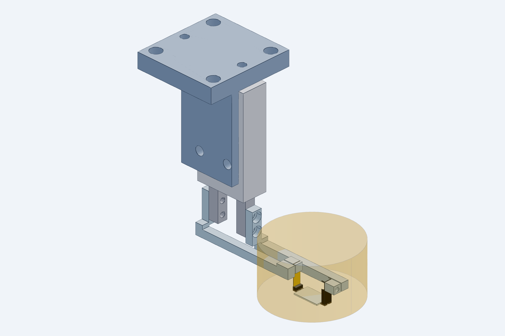
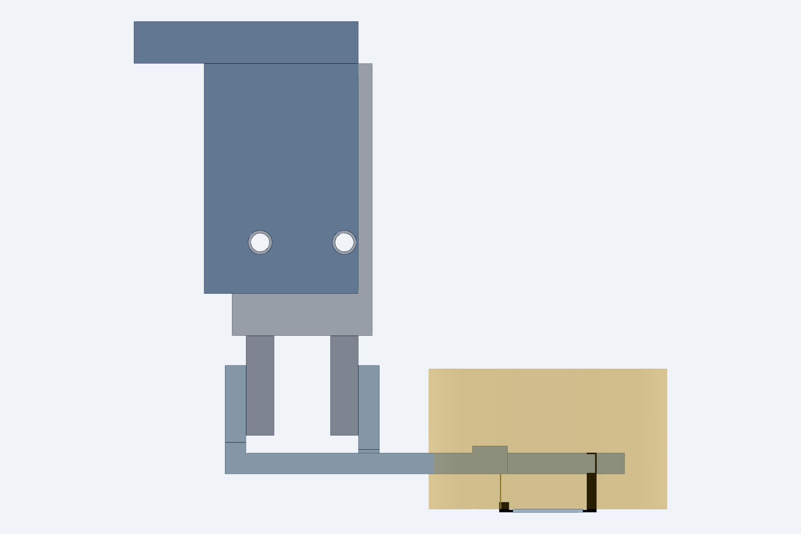

# Gripper module (end-face die gripper)

`model.py` (CadQuery) → `STEP/`, `STL/`, `renders/`, `checks.txt`. Rebuild with `python cad/build.py`
(see `cad/README.md`); `python cad/gripper/model.py [--horizontal]` alone is for iteration only.
Frame, die and contact rules: `cad/common`. Downstream users: `cad/nest` (checks against the jaws),
`cad/tray` (pocket vs open jaws), `cad/station` (placement, arm interface `IFACE`).

Open `STEP/gripper_module_assembly.step` in Fusion / SolidWorks / Onshape to review; send the per-part
STEP files to the shop. The assembly includes a dimensionally faithful stand-in for the SMC MHZ2-6D
(from the SMC catalog drawing), the die and a translucent 20 mm objective keep-out cylinder.
`STEP/gripper_module_assembly_vendor.step` (git-ignored, built when `cad/vendor/smc_MHZ2-6D.step` is present)
has the real SMC body and fingers.

## What the numbers say (`checks.txt`)

| Quantity | Value |
|---|---|
| Nose gap with fingers fully closed (hard stop) | 9.870 mm → blade preload 0.130 mm on a 10.000 die |
| Nose gap open | 13.87 mm (2.0 mm per side, MHZ2-6 stroke) |
| Flexure stiffness | 2.46 N/mm (0.127 mm × 3 mm spring steel, 5 mm free) |
| Grip force | 0.32 N ± 0.06 N over the ±25 µm die-length tolerance |
| Nose top below die top surface | 0.100 mm |
| Tallest tool part inside the objective footprint | near head top, 9.0 mm above die top (far bar 8.0 mm) |
| Actuator body X extent | −40 … −20 mm (objective barrel to X −12, Ø40 tube to X −15) |
| Body Y extent | −2 … 8 mm (fiber holders at Y ≤ −5 and ≥ 11) |
| Bracket / interface plate X extent | −54 … −22 mm; 25 × 25 pattern centred at X −38, Y 3 |
| Module height, die top to interface plate top | 69.5 mm |

## Parts

| # | File | Material | Qty | Make / buy | Notes |
|---|---|---|---|---|---|
| 1 | `cad/vendor/smc_MHZ2-6D.step` | SMC **MHZ2-6D-M9N** | 1 | buy | Ø6 parallel gripper, 2 × D-M9N switches. Fingers 4 × 4 mm at ±4…8 mm from the centre when closed (8 mm gap; 12 mm open), 2 × M2 on each finger at 2.5 / 7.5 from the tip. Body mounts by 2 × M3 through-threads along Y. |
| 2 | `STEP/far_arm_6061.step` | 6061-T6, hard anodize | 1 | CNC (Protolabs/Xometry) | Rigid arm. Root plate on the far finger's +X face (2 × M2 SHCS, counterbored), transition block, 3 × 3 bar in the Y 4.8–7.8 lane, head with M2 tapped hole for the tip block. |
| 3 | `STEP/near_arm_6061.step` | 6061-T6, hard anodize | 1 | CNC | Compliant arm. Root plate on the near finger's −X face, bar in the Y −1.8–1.2 lane, raised head (top 9.0 above die) with a 0.18 × 3.1 × 3 mm blade slot and an M2 clamp screw. |
| 4 | `STEP/far_tip_block_semitron.step` | **Semitron ESd 480** | 1 (+2 spare) | CNC | 3 wide × 2 thick × 8.5 tall. Nose band 0.35 tall protrudes 0.6 toward the die at Z 0.05–0.40. M2 clearance + countersink from the die side. Ø0.6 through hole at Z 0.25 for a thru-beam fiber sensor. |
| 5 | `STEP/near_tip_block_semitron.step` | Semitron ESd 480 | 1 (+2 spare) | CNC | 3 × 2 × 1.45 mm, same nose, blade slot 1 mm deep from the top, Ø0.6 sensor hole. Bonded to the blade. |
| 6 | `STEP/flexure_blade_0p127_steel.step` | 0.005″ feeler-gauge stock (C1095 spring steel) | 1 (+5 spare) | cut from stock | 3.0 wide × 9.0 long (1 in block, 5 free, 3 clamped). Cut with shears, deburr, degrease. |
| 7 | `STEP/bracket_6061.step` | 6061-T6 | 1 | CNC | L-bracket: 3 mm vertical plate on the body's −Y face (2 × M3 through the body), 6 mm top plate (X −54…−22, kept 7 mm outside a Ø40 microscope tube) with 4 × M4 clearance on 25 × 25 centred at X −38 and 2 × Ø3 dowel holes. Same pattern goes on every carrier. |
| 8 | — | M2 × 6 SHCS ×4, M2 × 5 ×2, M3 × 16 ×2, M4 ×4, Ø3 × 8 dowels ×2, 0.05 mm shim stock | — | McMaster | Stainless. |
| 9 | — | Loctite EA 9460 (or Hysol) for blade-to-block bond | — | — | Cure 24 h; bond line inside the block slot only. |
| 10 | — | Gauge die 10.000 × 6 × 0.500 mm, steel or ceramic | 1 | grind | Sets switch positions and verifies the 0.10 mm top gap. |

STL files (same names) are for printing check fixtures and for quick viewing; the shop gets the STEP.

## Tolerances that matter (call out on the drawings)

- Nose contact face position relative to the arm's root-plate bolt face: ±0.02 mm on both
  arms (sets the 9.87 gap; shims correct the rest).
- Nose band height 0.35 ± 0.02; nose top at 0.40 ± 0.02 from the block bottom.
- Contact faces parallel to the root-plate face within 0.02 over 3 mm.
- Bar straightness 0.05 over the length; arms must not sag into the die (5 mm nominal
  clearance above the die top).
- Blade slot 0.18 +0.02/−0 wide.

## Assembly and tuning

1. Bolt the bracket to the actuator body (2 × M3 through the body threads), then the
   actuator+bracket to the carrier's 25 × 25 pattern with the two dowels.
2. Bolt the far arm to the far finger and the near arm to the near finger (2 × M2 each,
   0.05 mm shim pack under the far root plate to start).
3. Screw the far tip block to the far head (M2 from the die side).
4. Bond the blade into the near tip block slot; after cure, slide the blade into the near
   head slot and lock the M2 clamp screw. Check the blade hangs plumb.
5. Close the gripper on the **gauge die**. Under the microscope, verify the nose top sits
   0.10 mm below the die surface on both sides and that the nose bands touch the end
   faces over their full 3 mm. Adjust shims under the far root plate until the closed
   gap with no die is 9.87 ± 0.02 (measure with feeler gauges).
6. Grip force: rest the gripper so the near nose presses a 0.001 g pocket scale through a
   10.13 mm spacer; target 30 ± 6 g.
7. Set the two D-M9N switches at the fully open and fully closed piston positions. Die
   presence is **not** derivable from these switches (the hard stop is the same with or
   without a die); use the camera in Month 1 and the Ø0.6 fiber sensor provision later.

## Horizontal actuator layout (`--horizontal`, files with `_h`)

The alternative in which the MHZ2-6D lies along Y beside the die line (body X −40…−20, Y −44.5…−5.7,
Z 10…20, ports toward −X), the fingers point +Y toward the bars, the arm root plates hang from the finger
outer faces, and the bracket is a flat plate on the body using the actuator's vertical M3 through-threads.
Parts that change: `far_arm_6061_h`, `near_arm_6061_h`, `bracket_6061_h`; tip blocks and blade are identical.
`IFACE` (the footprint the station's arm end plate covers) changes with the layout.

| | vertical (default) | horizontal |
|---|---|---|
| bracket top plate to die bottom | 70 mm | 26 mm |
| arm crossing over the X axis | Z 82 (X slider top 65 + far-column drop 12 + 5) | same, unavoidable: the arm comes from the Z slider and must clear the X slider |
| what spans crossing → gripper | SMC body + L-bracket (the actuator is part of the load path) | one 25 mm square drop bar (56 mm) + flat plate |
| tallest part under the objective | near head, 9.0 mm above die top | same |
| far root plate to objective barrel | 7.0 mm | 7.0 mm |
| actuator body to objective barrel / tube | 7.9 / 4.9 mm | 9.4 / 40.5 mm |

The horizontal layout does **not** shorten the drop from the arm to the die (set by the X-axis slider
height); it moves that drop out of the actuator into a stiff bar and takes the actuator out of the Ø40-tube
neighbourhood. The vertical layout stays the baseline. Renders: `renders/gripper_h_*.png`, `renders/gripper_vendor_h_iso.png`.

## Open items

- Confirm MHZ2-6 finger thread depth and that M2 × 6 does not bottom out (SMC drawing
  shows 4 mm fingers; use M2 × 5 if needed).
- The far bar passes over the die's Y = 6 edge at 5 mm height in the Y 4.8–7.8 lane; the
  near bar hangs over the Y = 0 edge. Both are above the fiber axis by 5 mm after a 1 mm
  fiber retract. Confirm against the measured fiber-holder height (`common.FIBER`).
- The objective must clear 9.0 mm above the die top (near head). Measure the working
  distance; if it is below ~11 mm, lower `arm_h` and shorten `blade_free` (stiffer blade
  → thinner stock, 0.004″).
- Bracket is on the −Y face; if the fiber holder on that side needs the room, mirror it
  to +Y (one parameter).
