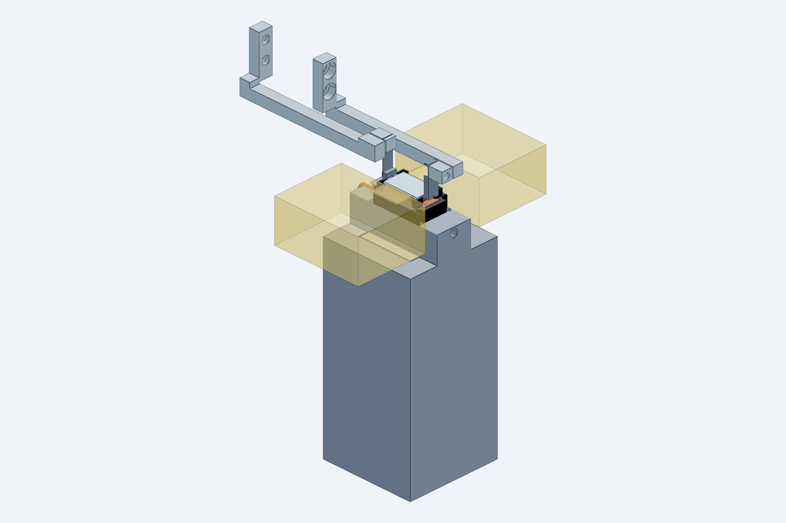
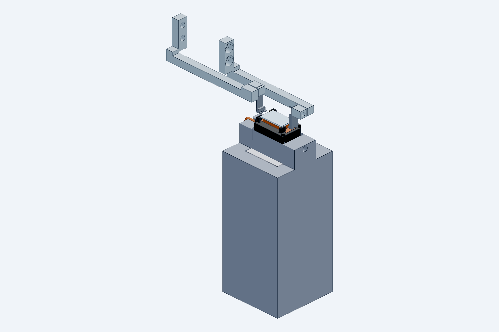

# Nest (chip stage): self-registering, temperature-controlled

`model.py` (CadQuery) → `STEP/`, `STL/`, `renders/`, `checks.txt`. Rebuild with `python cad/build.py`.
Imports `cad/gripper` (the jaws for the clearance checks) and `cad/common` (die, contact rules,
fiber-holder envelope `FIBER`). Used by `cad/station` (`riser()`, `chuck()`, `cage()`, `cage_parts()`,
`tec()`, `N`).

## What it does

The gripper sets the die down on a lapped copper vacuum-chuck pad 0.2 mm short of two hard-stop pads,
opens, and pushes the die onto the pads with its own compliant nose (**push-to-stop**). The pads fix X and
yaw, the pad fixes Z, pitch and roll; Y is left free for the fiber stages (which measure the gap anyway)
and caged to ±0.6 mm. Nothing touches the facets or the top surface; only the two stop pads and the chuck
ever touch the die.

| Axis | Mechanism |
|---|---|
| Z, pitch, roll | lapped copper chuck pad (flat ≤ 3 µm), 9 × 5 mm = 75 % of the backside, 0.5 mm inboard of every edge |
| X, yaw | two Semitron ESd 480 **stop pads** on the +X end face (Y 0.6–1.2 and 4.8–5.4, 0.6 mm in from the facets, contact band Z 0.05–0.40): yaw from a 4.2 mm base ≈ 0.03° |
| Y | free; **corner guards** 0.6 mm outside each facet plane only at X ≤ 0.5 and X ≥ 9.5 where no fiber goes, plus an X guard 0.4 mm behind the −X end face |

Milling cannot make a sharp inside corner, and the die's corners are not trusted either: the stop pads
are 0.6 mm from the facets and the 0.2 mm relief between pad and guard keeps the die corner in free
space. The die registers on two pads and a plane, never in a corner.

**Push-to-stop numbers** (`checks.txt`): set down 0.2 mm short, jaws open (+1.5 mm per side), gripper
indexes +1.735 mm in X; the open near nose meets the −X end face, slides the die 0.2 mm onto the pads and
overtravels 0.10 mm, so the flexure blade limits the push to 0.25 N. Vacuum on, jaws retract. The camera
then reads Y and confirms X (a die that stuck to the chuck stops short and is caught there).

## Fiber access

The fiber tips protrude ~5 mm from their holders (`common.FIBER`), so the holder bodies come to Y −5 and
Y +11 (facets at Y 0 / 6), 25 mm wide, from 8 mm below to 4 mm above the fiber axis (envelope; measure
the real holder). Nothing of the nest may be in that space: the riser is a **10 mm wide neck** (Y −2…8)
from the cage plate down to Z −12, below the holders' underside, and only then widens to 26 × 26 mm for
the TEC and the KB1X1 base. Checked: cage and neck 3.0 mm from the holder faces, chuck block 5.5 mm, wide
body 4 mm under the holders; gripper arms 3.2 mm from the holders at the nest.

## Thermal and vacuum

The chuck is a C101 copper block (Ni-plated, pad lapped after plating): a 9 × 5 mm pad island on a
13 × 4.8 mm block whose neck passes through the cage plate and the riser (0.3 mm air gap all round) to a
**15 × 15 × 2.5 mm TEC** in the riser's wide section at Z −12; the aluminium riser is the hot-side heat
sink (add fins or a water block on the wide section above ~2 W). Thermistor bore Ø1.0 × 5 deep from the
+X face at Z −6. **Vacuum**: 6 × Ø0.5 holes in the pad into a 7 × 4 × 1 mm plenum, bore to a Ø1.5 stub
tube leaving the −X face at Z −6 through a clearance hole in the riser neck (no seal between copper and
riser); silicone hose to the M5 fitting.

## Parts

| File | Material | Make | Notes |
|---|---|---|---|
| `STEP/nest_chuck_copper.step` (+STL) | C101 copper, Ni plate | CNC + lap | pad island, vacuum holes, plenum, neck, stub tube, thermistor bore |
| `STEP/nest_cage_semitron.step` (+STL) | Semitron ESd 480 | CNC | one piece: plate with the copper window, 4 corner blocks (stop pads, X guard, Y guards); 2 × M2 + 2 × Ø1.5 dowels to the riser |
| `STEP/nest_riser_6061.step` | 6061 | CNC | T-riser: neck, wide body, TEC pocket, wire channel, vacuum-stub and thermistor clearances; on the KB1X1 |
| — | TEC 15 × 15 × 2.5, thermistor, KB1X1 (Thorlabs 2374-E0W) | buy | |

Assemblies: `STEP/nest_module_assembly.step` (die seated, jaws closed, fiber/holder envelopes) and
`STEP/nest_module_setdown.step` (jaws open at the set-down position). `checks.txt` lists every
clearance: corner blocks vs die (seated / set down / Y-offset), vs the jaws closed / open / during the
push, nest vs fiber and holder envelopes, holders vs the gripper. Expected non-OK lines: the two stop
pads TOUCH the seated die (by design) and the ledge-height items marked TIGHT at exactly 0.

## Open items (measure on the bench)

- Real fiber-holder envelope (width, height below/above the fiber axis, front-face-to-tip): `common.FIBER`.
- TEC part number, heat load and whether the riser needs a water block.
- Die backside finish (vacuum seal on a lapped pad needs it flat and clean).
