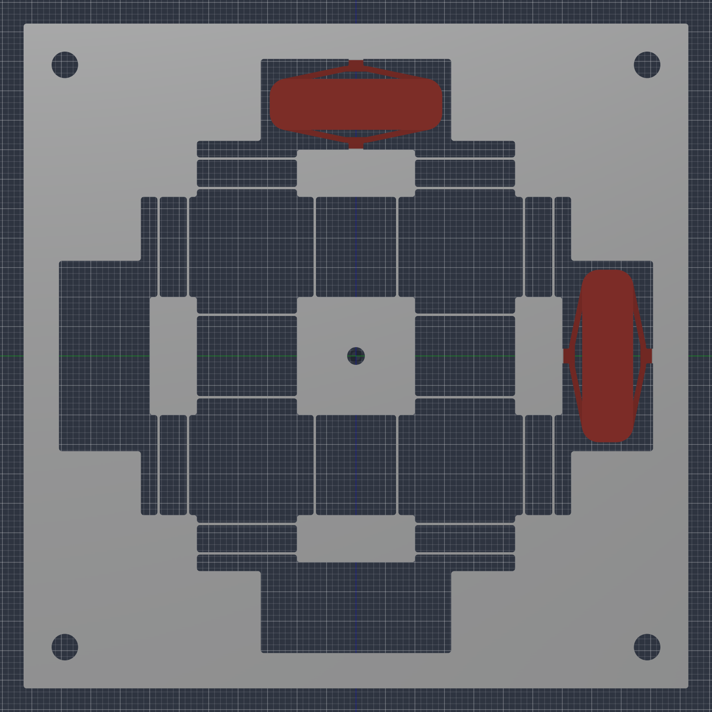
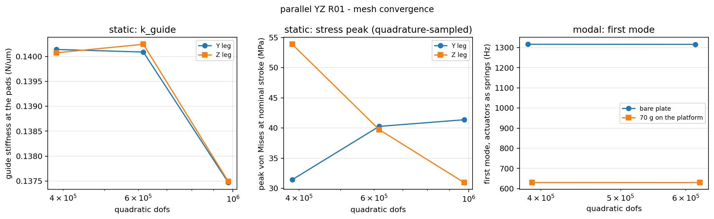
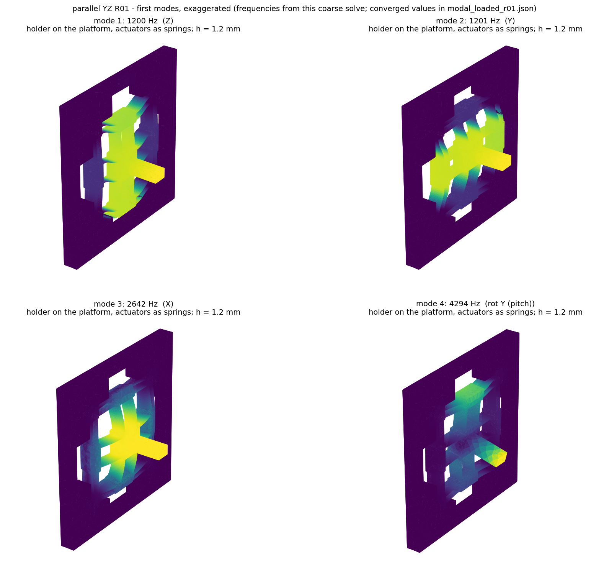
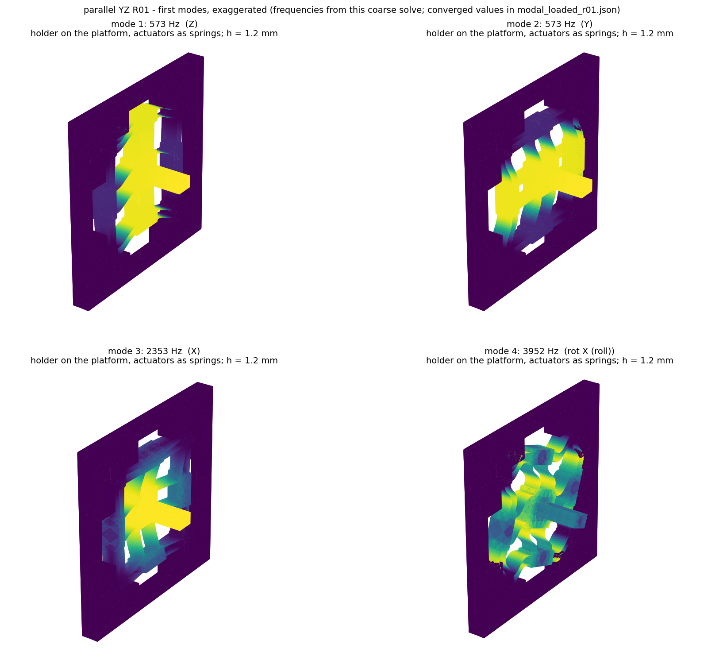

# Parallel-kinematic YZ platform, concept R01

A candidate replacement for the stacked X/Y/Z head in `../`: **one wire-EDM
plate, two APA60S grounded to its frame, the fiber through its centre.** Built
to answer the question the stacked design never posed - stacked or parallel? -
with the same solver pipeline as [`../simulations/fem_r01/`](../simulations/fem_r01/README.md),
so the two architectures can be compared number for number.



## The concept

The plate lies in the YZ plane, perpendicular to the optical axis; wire EDM cuts
the whole profile through its 10 mm thickness, which is also the APA60S thickness.
The fiber passes through a Ø3 hole in the 20 × 20 mm central platform and its
clamp sits on the platform's front face. Four identical legs hold the platform,
two of them driven:

```
frame ==[4 guide leaves, bend along the leg]== input stage ==[2 coupler leaves, bend across the leg]== platform
                    APA60S: frame pad <-> input stage pad, collinear with the leg
```

The **input stage** can only move along its leg (its guide leaves are axially
stiff across it); the **coupler leaves** are axially stiff along the leg and
compliant across it. So the Y actuator moves its input stage in Y, the couplers
carry that motion rigidly into the platform, and when the Z actuator moves the
platform in Z the Y couplers simply bend and the Y input stage - and the Y
actuator - see nothing. Both actuators are grounded, only the platform, the
input stages and the leaves move, and the actuator only ever sees motion along
its own axis. The passive −Y and −Z legs mirror the driven ones so that the
stiffness the platform sees is symmetric about its centre: a force through the
centre of stiffness produces no rotation.

Above it in the architecture, the coarse X stage (LX20, already in the station)
and, if axial dither is wanted at piezo bandwidth, the single-axis APA60S guide
already validated in `fem_r01` as a fine X carrying this plate:

```
coarse X (LX20) -> [optional fine X: the fem_r01 single-axis module] -> this YZ plate -> fiber clamp
```

Y and Z do the search; X does slow axial optimisation, so the fine X module is
allowed to be the slow, heavy axis. That is the same nesting argument the design
brief makes, applied to a two-plus-one split instead of a three-deep stack.

### Dimensions (`model.py`, dict `P`)

| | |
|---|---|
| plate | 10 × 112.8 × 112.8 mm, 7075-T6, **199 g** with pockets, before lightening the 30 mm corner blocks |
| leaves | 0.40 × 17 mm, 10 mm deep, R0.5 roots on every profile vertex; 24 leaves |
| platform | 20 × 20 mm, Ø3 fiber hole |
| input stages | 8 × 20 mm |
| APA pockets | 15.4 × 33 mm, pad lands 2.5 × 5 mm raised 0.2 mm (vendor pad footprint, one M2 each) |
| moving mass per axis | ≈ 25 g (platform 11 g, two input stages 9 g, leaves, half an APA) |
| mounting | back face on a base with a central opening, four M4 at the corners |
| payload | the fiber holder: aluminium block 25 × 10 × 7 mm, **4.9 g** (user, 2026-09-07), 25 mm along the fiber on the front face (orientation assumed), tip 30 mm ahead |

The leaf section is chosen from the stroke budget: the guide may take at most
\(k_\text{max} = k_\text{APA}(d_\text{free,min}/60 - 1) = 0.227\) N/µm before the
worst-case actuator misses 60 µm. Beam theory gives 12 leaves bending per axis,
\(k = 12\,E b t^3/L^3 = 0.11\) N/µm at 0.40 × 17 mm - the brief's own
0.10–0.15 N/µm window - and the fem_r01 result says a filleted FE lands ~20 %
above the beam number. Everything downstream is a parameter; change `P`, rebuild,
re-solve.

## How it addresses the hard parts of a parallel stage

The user's list, item by item, with where the answer comes from:

| concern | how the design handles it | evidence |
|---|---|---|
| cross-axis coupling | decoupled P-P legs: the other axis' motion is absorbed by the couplers, never reaching the actuator; symmetric legs put the centre of stiffness at the platform centre | `static_r01.json` coupling at full stroke; "other pad" motion |
| rotation of the fiber tip | the four legs are far apart (guide leaves at radius 27 mm) and the plate is symmetric through its mid-thickness, so pitch/yaw have no nominal source; in-plane rotation is held by the couplers' axial stiffness at ±7 mm | `theta_urad` and `tip_off_axis_um` at full stroke |
| parasitic displacement | the arc foreshortening of a leaf pair (0.6 d²/L ≈ 0.13 µm at 60 µm) is cancelled by the mirrored leg on the opposite side | `platform_off_axis_um` |
| unequal stiffness | Y and Z legs are the same rectangles rotated 90° | k_Y = k_Z in the results to 4 digits |
| piezo preload | none to design: the APA60S carries its own; the pocket is the vendor pad-to-pad length plus the two lands | vendor STEP: pads at ±7.5 |
| flexure stress | R0.5 roots on every vertex, 0.4 mm webs; stress at full stroke reported and its convergence tracked | `peak_von_mises_MPa` |
| actuator tolerance | each actuator drives one input stage guided by its own parallelogram; a stroke difference between the two units changes range, not straightness | by construction |
| thermal expansion | both actuators on the same frame, symmetric legs: uniform expansion moves the platform nowhere | by symmetry, not yet analysed |
| first resonance | moving mass ≈ 25 g per axis with the 1.7 N/µm actuator in parallel with the guide | `modal_r01.json`, `modal_loaded_r01.json` |
| actuators fighting each other | they cannot: each one's force path to the platform passes through couplers that are compliant along the other's axis | "other pad" motion in the statics |

What it does **not** give for free, honestly: a 113 mm square plate (the stack's
footprint is 70 × 70, but 106 mm tall); a first article that is the whole
mechanism rather than one axis (PLAN.md section 5's single-axis bench step would
become "one leg on the bench", which the geometry allows - a leg is a complete
single-axis guide); and the fiber's service loop must come from behind the
plate through the base opening.

## Results

All three result files are mesh-converged (`static_r01.json`, `modal_r01.json`,
`modal_loaded_r01.json`); the stress peak is the one quantity that is not, as in
fem_r01, and is quoted with that caveat.

| quantity | value | converged? |
|---|---|---|
| guide stiffness at the pads, Y and Z | **0.1375 N/µm** (identical to 4 digits) | yes: 0.1406 → 0.1401 → 0.1401 → 0.1375, −1.9 % at 975k dof |
| loaded stroke, worst-case / nominal APA | **62.6 / 69.1 µm** | yes |
| platform per pad displacement | 0.9956 (coupler axial stretch costs 0.4 %) | yes |
| cross-axis coupling at nominal stroke | **0.002 %** (1.5 nm) | nominal zero by symmetry |
| tip off-axis error at nominal stroke | ±0.001 µm, rotations ≤ 0.16 µrad | nominal zero by symmetry |
| other actuator's pad during a stroke | 0.000 µm | decoupling works as drawn |
| peak von Mises at nominal stroke | 31–54 MPa across densities | **no** (fillet peak, quadrature-sampled) |
| gravity, 4.9 g holder on the platform | 0.15 µm sag, 0.32 µrad pitch, **0.16 µm tip drop**; Z APA carries 0.24 N | yes |
| first mode, bare plate, actuators as springs | **1316 Hz** (Y/Z pair) | yes, 0.02 % |
| first mode, bare plate, no springs | 370 Hz | the guide alone, cf. fem_r01's 331 Hz |
| **first mode, holder on the platform** | **1200 Hz** (Y/Z pair), then 2636 Hz X, 4280 Hz pitch, 4330 Hz yaw, 4477 Hz roll | yes, 0.03 % |
| same with the earlier 70 g surrogate (first solve, kept for the record) | 630 Hz; gravity 0.55 µm sag, 5.2 µrad pitch, 0.78 µm tip drop | yes |



### Convergence

| h_fine | tets | dofs | k_guide Y (N/µm) | vM at stroke Y / Z (MPa) | f₁ bare (Hz) | f₁ with holder (Hz) | static / modal solve |
|---|---|---|---|---|---|---|---|
| 1.20 mm | 40 058 | 240 219 | 0.1406 | 29.0 / 29.5 | 1317 | 1200 | 79 s / 30 s |
| 0.90 mm | 64 794 | 385 968 | 0.1401 | 31.4 / 53.9 | 1316.4 | 1200.0 | 105 s / 39 s |
| 0.70 mm | 105 586 | 616 692 | 0.1401 | 40.3 / 39.7 | 1316.1 | 1199.6 | 172 s / 205 s |
| 0.55 mm | 169 951 | 975 357 | 0.1375 | 41.4 / 31.0 | – | – | 312 s / – |

Stiffness and frequencies are flat from the coarsest mesh: they are global
quantities set by the leaf sections. The stress peak wanders between 30 and
54 MPa and swaps between legs from one mesh to the next - it is the value of a
fillet singularity sampled wherever a quadrature point happens to land. Read it
as "tens of MPa at full stroke", far below any fatigue concern for 7075 (the
allowable itself is still an open item in `cases.json`), and do not quote a digit.

### What the modes say



- The driven pair (Y, Z) is the platform and its two input stages riding on the
  actuator spring: 1316 Hz bare, **1200 Hz with the 4.9 g holder** (and 630 Hz
  with the 70 g surrogate of the first solve, which tripled the moving mass).
  The lumped estimate √(k/m)/2π with k = 1.84 N/µm gives 1.3 kHz at 27 g,
  1.2 kHz at 32 g and 690 Hz at 97 g, so the FE says the leaves and stages
  behave as the simple model assumes.
- Without the springs the same pair sits at 370 Hz: the actuator provides 92 % of
  the driven-axis stiffness, so **the actuator, not the flexure, sets the
  bandwidth**, and the flexure's job is only to stay below the stroke budget.
- Platform X (out of plane) is 3.1 kHz bare, 2.6 kHz with the holder; pitch
  and yaw 4.3 kHz, roll 4.5 kHz. Nothing local (leaf or stage) below 4.4 kHz.
  With the holder in place there is a factor of 2.2 between the driven pair and
  the next platform mode, so the search axes are cleanly the first two modes.
- With the 70 g surrogate the block's own rocking appeared at 2.2 kHz; with the
  real holder that mode is above 4 kHz and the holder no longer sets anything.

### Variant `apa120s`: the longer-stroke actuator

`variants/apa120s/` is the same plate with the CEDRAT APA120S (datasheet rev
06/2024: 140 / 130 µm nominal / min stroke, 0.33 N/µm, blocked force 46 N,
external force limit 32 N, blocked-free resonance 1300 Hz, 7.2 g, 28.8 × 13 ×
10 mm, same M2 pads) in a 13 mm pocket, and the leaves thinned to 0.30 mm to
spend its larger stroke budget on range. Same holder, same gates, all converged
(bare modal at one density only):

| | R01, APA60S, 0.40 mm leaves | `apa120s`, 0.30 mm leaves |
|---|---|---|
| plate | 112.8 mm, 199 g | 108.8 mm, 181 g |
| k_guide | 0.1375 N/µm | **0.0605 N/µm** |
| loaded stroke, worst-case / nominal actuator | 62.6 / 69.1 µm | **109.6 / 118.1 µm** |
| stiffness the moving mass sees | 1.84 N/µm | 0.39 N/µm |
| first mode with the holder | **1200 Hz** | **572 Hz** |
| first mode, bare / springless | 1316 / 370 Hz | 627 / 248 Hz |
| next platform modes, loaded | 2636 X, 4280 pitch | 2349 X, 3947 roll, 3990 pitch |
| gravity with the holder | 0.15 µm sag, 0.32 µrad, 0.16 µm tip | 0.68 µm sag, 0.41 µrad, 0.69 µm tip |
| coupling / tip error at full stroke | 0.002 % / ±0.001 µm | 0.001 % / ±0.001 µm |
| guide force at nominal stroke | 9.5 N | 6.6 N (limit 32 N) |
| stress peak at nominal stroke | 30–54 MPa, not converged | 28–70 MPa, not converged |

Read together: **±55 µm of capture for 572 Hz, or ±33 µm for 1200 Hz.** Both
sit far above the 300 Hz target and above what a 100–150 Hz spiral needs, and
the APA120S's own blocked-free resonance (1300 Hz) is above the plate's 572 Hz,
so the plate, not the actuator, still sets the first mode. With range the
stated shortfall and the load 5 g, the APA120S is the better fit; the price is
2.1× on bandwidth and 0.7 µm of sag, both harmless here. Stress stays in the
tens of MPa with the thinner leaves. Renders and the ParaView file are in
`variants/apa120s/renders/`.



### Against the stacked P0 head

| | stacked P0 (`../`) | parallel R01 (this) |
|---|---|---|
| moving mass on the search axes | X carries Y, Z and the payload: ~250 g | 25 g + payload |
| guide stiffness on the driven axis | 0.0395 N/µm (fem_r01) | 0.1375 N/µm |
| loaded stroke, worst-case APA | 66.5 µm | 62.6 µm |
| loaded first mode | not solved; lumped √(1.74 N/µm / 0.25 kg) ≈ 420 Hz before series compliance | **1200 Hz** with the 4.9 g holder (630 Hz at 70 g), FE, converged |
| envelope | 84 × 70 × 106 mm, optical centre 81 mm up | 113 × 113 × 10 mm |
| mass excl. payload | 255 g | 199 g plate + 17 g actuators |
| actuators | 3 APA60S, two of them moving | 2 APA60S, both grounded |
| bolted joints in the moving path | 6 | 0 |

The parallel plate spends 3.5× more of the stroke budget on the guide and
gets a ~3× higher loaded first mode for it, with the coupling and tip-angle
questions answered by symmetry rather than by stacking tolerances. Its cost is
footprint and a first article that is the whole mechanism.

## Pipeline

```powershell
# CadQuery, in the cad environment (OCP teardown is skipped with os._exit, see ../README.md)
& C:\Users\<user>\pythonEnvs\cad\Scripts\python.exe -u model.py

# gmsh + scikit-fem + PARDISO, in pic-env (../simulations/fem_r01/requirements.txt)
$py = "C:\Users\<user>\pythonEnvs\pic-env\Scripts\python.exe"
& $py -B solve_static.py                        # density sweep -> static_r01.json
& $py -B solve_modal.py                         # bare plate    -> modal_r01.json
& $py -B solve_modal.py --loaded                # holder on the platform -> modal_loaded_r01.json
& $py -B figures.py                             # renders/*.png + static_r01.vtu
& $py -B figures_results.py                     # convergence curves, mode shapes

# Variants: model.py --variant <name> builds into variants/<name>/ (same file
# names), and every solver takes the same --variant. Names are in model.VARIANTS.
& C:\Users\<user>\pythonEnvs\cad\Scripts\python.exe -u model.py --variant apa120s
& $py -B solve_static.py --variant apa120s
```

| file | role |
|---|---|
| `model.py` | the parametric plate (`P`), the actuator table (`ACTUATORS`), named variants (`VARIANTS`), pad lands, holder block; writes `STEP/` and `geometry_report.json` |
| `geometry_report.json` | every box the FE needs: leaves, pads, fixture rule, platform, payload, tip |
| `mesh.py` | gmsh, Box size fields on the recorded leaf boxes, Delaunay |
| `fe_common.py` | materials by position, patches, actuator springs (Woodbury), rigid-body fit |
| `solve_static.py` | 1 N pad pairs, pure and with springs; gravity on the loaded plate |
| `solve_modal.py` | modes with the actuators as springs, labelled by platform motion |
| `figures.py` | profile, mesh, deformed shapes, von Mises, ParaView `.vtu` |
| `figures_results.py` | convergence curves from the result files, first four loaded mode shapes |
| `STEP/` | plate, plate + holder block, plate + two vendor APA60S |
| `variants/<name>/` | the same layout for each named variant (STEP, report, results, renders) |

The actuator is an axial spring between its two pad lands (1.7 N/µm) plus half
its mass on each; it is applied through the Woodbury identity so the plate is
factorised once per density and the pure, sprung and modal solves all reuse it.
The frame's back face is fixed outside the 73 mm central square, i.e. where a
base plate with a central opening would carry it.

## What this does not tell you

No actuator off-axis stiffness or internal modes (a spring has neither), no
mount compliance below the back face, the holder is a plain block whose
orientation on the platform is assumed, no fatigue allowable, no station
integration, no manufacturing
asymmetry - the nominal coupling is zero by symmetry, so the coupling a real
part shows is set by EDM tolerance, not by this model.
