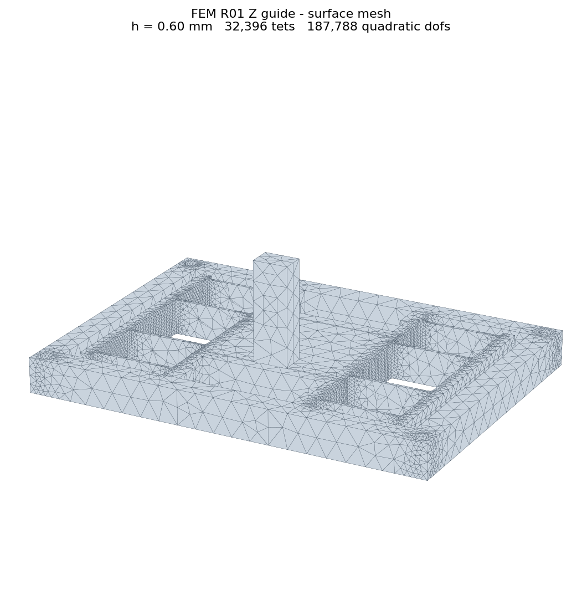
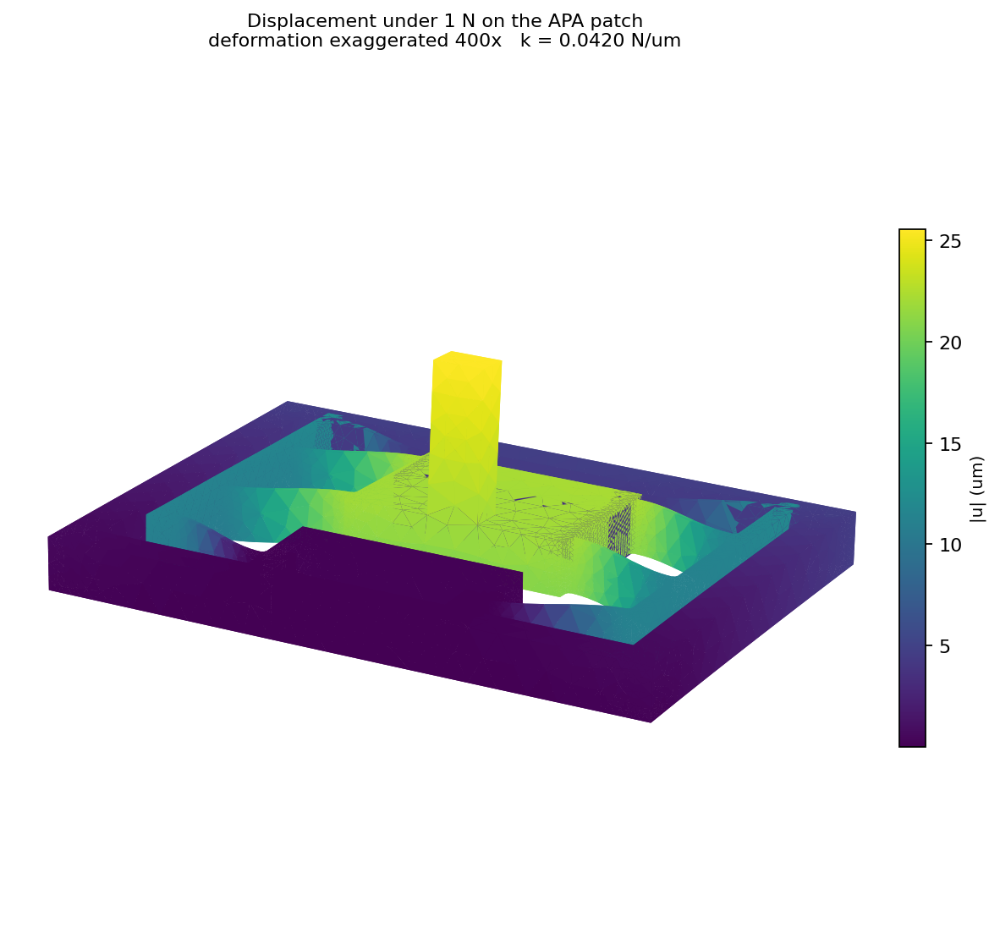
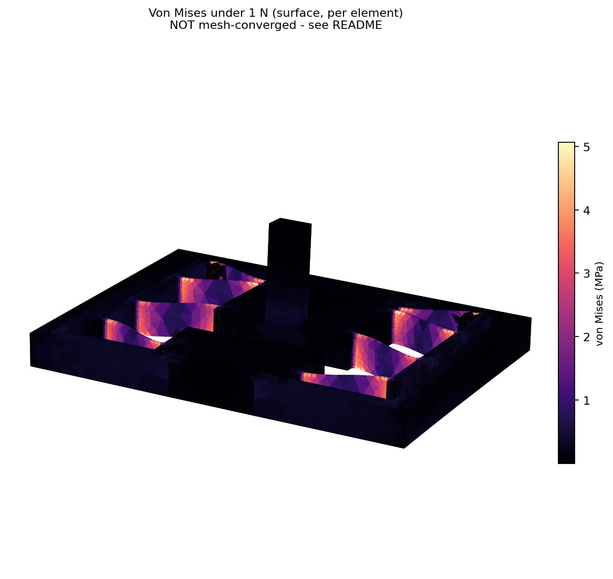

# FEM R01 — single-axis guide, meshed and solved outside Fusion

Revision **R01** of the Z guide: the released P0 export plus 0.5 mm root radii and
a bonded surrogate for the carriage land. It exists to answer one question with
evidence — **what is the guide's own stiffness along its driven axis?** — and it
answers it. Everything else in `../PLAN.md` remains open.

## Result

| quantity | value | converged? |
|---|---|---|
| Guide stiffness \(k_\text{guide}\) | **0.0395 N/µm** | yes, 1.29% at the finest mesh |
| Displacement under 1 N | 25.32 µm | yes |
| Peak surface von Mises under 1 N | 6.7 MPa | **no — still climbing 4.11%** |
| First unloaded mode, **guide alone** | **330.7 Hz** | yes, 1.11% between densities |

The analytical screening in `../screening.py` predicted **0.039 N/µm**. The FE
result is **1.3% above it**. Two independent methods agreeing this closely is a
real cross-check on both; it was not guaranteed, since the R0.5 roots and the
bonded land both add stiffness the beam model does not carry.

### Read the stress number with care

Peak von Mises goes 6.3 → 6.2 → 6.4 → 6.7 MPa across the four densities:
non-monotonic early, still rising 4.11% at the finest. It is **not converged**,
and it is sampled at quadrature points, so it also under-reads the true peak at
the fillets. `PLAN.md` section 2 asks for a separately justified stress
criterion and this does not meet one. Do not quote it as the root stress.
Stiffness is a global quantity and converges quickly; a stress peak at a fillet
does not.

## Why this is not in Fusion

Fusion's Simulation extension solves this class of problem, but its API cannot be
driven. In Fusion **2704.1.53**, `adsk.sim` ships the classes — `createStudy`,
`Loads`, `Constraints`, `MeshSettings`, `Study.solve`, and
`ModalFrequenciesStudyType` — but the product handle they all hang off is
unreachable:

- `doc.products.itemByProductType('SimulationProductType')` → `failed to find product`
- `doc.products.item(1)` → `InternalValidationError : res`, reproducibly
- inside the Simulation workspace, `activeProduct` is a bare `adsk::core::Product`
  of type `SimCaseProductType` that casts to none of the `adsk.sim` classes

Tested on a freshly rebuilt document, and again after saving the document to the
cloud — saving was a hypothesis for the failure and it was **wrong**, the
behaviour is identical either way. Two further notes for anyone tempted to retry:
a workspace transition cannot complete inside one synchronous MCP script (it
leaves the session with no active product until `doc.activate()` restores it),
and entering the Simulation workspace raises a modal **New Study** dialog that
blocks the scripting API entirely until a human dismisses it.

Setting the study up by hand in the GUI remains possible. It is not automatable,
so it cannot be iterated on, which is why this pipeline exists.

## Pipeline

```powershell
# pic-env (3.11); see requirements.txt in this folder. The cad env has no meshing stack.
$py = "C:\Users\<user>\pythonEnvs\pic-env\Scripts\python.exe"

& $py -B solve_static.py                     # four-density sweep -> static_r01.json
& $py -B solve_static.py --sizes 0.45        # one density, while iterating
& $py -B solve_modal.py                      # two densities -> modal_r01.json
& $py -B figures.py                          # renders/ PNGs + ParaView .vtu
```

| file | role |
|---|---|
| `geometry.py` | builds the R01 revision in Fusion from the P0 STEP (roots, land, split patches) |
| `mesh.py` | gmsh meshing, refined by distance from the leaves and root fillets |
| `solve_static.py` | 1 N compliance case and the mesh-convergence sweep |
| `solve_modal.py` | unloaded modal frequencies, same fixture |
| `figures.py` | mesh / displacement / von Mises renders and a `.vtu` |
| `static_r01.json`, `modal_r01.json` | results with their convergence evidence |
| `renders/` | figures below, plus `static_r01.vtu` for ParaView |

Scratch meshes go to `work/`, which is gitignored.

### Boundary conditions attach themselves

`geometry.py` splits two faces into the solid, and they survive into the STEP as
distinct surfaces that match their recorded boxes uniquely:

| patch | box (mm) | area | role |
|---|---|---|---|
| `force` | x −1.25…1.25, y −9.5, z 12.5…17.5 | 12.50 mm² | 1 N total, +Y |
| `fixture` | x −8…8, y −25, z 0…6 | 96.00 mm² | fully fixed |

Both are read from `geometry_report.json` at run time, so nothing is duplicated
and no face is picked by hand. Change the geometry, re-export, re-run — the
boundary conditions re-attach. That is what makes this iterable.

The load patch sits at z 12.5–17.5 on a post standing above a 6 mm plate, so a
real part of the measured displacement is post bending and plate twist rather
than leaf translation. Worth separating before quoting this as a leaf stiffness.

## Meshing and the solver

Leaves are 0.5 mm thick in a 70 × 50 × 23 mm part, so a uniform mesh fine enough
for them is ~750k elements. `mesh.py` instead grades element size by distance
from the surfaces that need it: the leaf side walls (planar faces with X normals
at |x| = 13 and 27, the stations `geometry.py` uses for its 32 fillet edges) and
the R0.5 roots (the only cylindrical faces in the solid).

**pypardiso is effectively required.** scipy's SuperLU solved 104k dofs in 49 s
and then failed to finish 188k dofs in 24 minutes; MKL PARDISO does the same
188k in 88 s and 1.2M in 709 s. The code falls back to scipy if pypardiso is
missing, but only the coarsest densities are then reachable.

Installing it needed a pip fix: `site-packages/00_truststore_inject.pth` calls
`truststore.inject_into_ssl()` in every `pic-env` process, and pip ≥ 24.2 injects
truststore itself, so the double injection sends `SSLContext.verify_mode` into
infinite recursion. The `.pth` was moved aside for the install and restored, so
**pip in `pic-env` is still broken for the next person**.

### Convergence

| h_fine | tets | dofs | displacement | k (N/µm) | peak vM | solve |
|---|---|---|---|---|---|---|
| 0.60 mm | 32 396 | 187 788 | 23.8031 µm | 0.0420 | 6.3 MPa | 88 s |
| 0.45 mm | 68 932 | 372 129 | 24.3021 µm | 0.0411 | 6.2 MPa | 231 s |
| 0.35 mm | 134 368 | 688 365 | 24.9963 µm | 0.0400 | 6.4 MPa | 535 s |
| 0.28 mm | 248 101 | 1 215 696 | 25.3185 µm | 0.0395 | 6.7 MPa | 709 s |

Successive displacement changes 2.10%, 2.86%, 1.29% — inside the 5% gate and
tightening monotonically from the stiff side, as expected for displacement-based
elements.

### Modal, guide alone

Ten modes at two densities, fixture patch fixed, nothing else attached
(`modal_r01.json`):

| h_fine | dofs | first ten modes (Hz) | solve |
|---|---|---|---|
| 0.60 mm | 187 788 | 334.4, 393.0, 470.9, 1071.2, 1282.9, 1300.9, 1621.6, 1719.1, 1838.4, 2282.2 | 99 s |
| 0.45 mm | 372 129 | 330.7, 391.2, 469.3, 1066.2, 1269.8, 1288.0, 1616.0, 1715.2, 1833.6, 2275.9 | 180 s |

Drift ≤ **1.11%** on every mode, so the frequencies are converged — *for this
model*. **330.7 Hz is not the stage resonance and must not be compared with the
300 Hz target in `cases.json`.** That target is a loaded first mode; this model
carries no holder mass, no actuator stiffness or mass, and no mount compliance,
all of which push the assembled figure down, some of them hard. Read it as an
upper bound and as evidence that the guide itself is not the limiting element.

Shift-invert needs the factorisation reused across Lanczos iterations. A
persistent `PyPardisoSolver` does that; calling `pypardiso.spsolve` inside the
`LinearOperator` would refactorise every iteration and is the obvious trap here.

## Figures

Rendered at h = 0.60 mm — coarse enough to see the elements, which is the point
of the mesh figure. **The numbers in the captions are from that coarse solve, not
the converged one.** For real inspection open `renders/static_r01.vtu`.





Displacement is exaggerated 400×. Von Mises concentrates in the leaves and their
roots with the frame and post near zero, which is the flexure behaving as
intended.

## What this does not tell you

No gravity, no payload, no APA stiffness or mass, no coupling compliance, no
mount compliance, no off-axis loading, no fatigue, no station integration. The
modal result is the **guide alone** — `PLAN.md` section 3 is explicit that the
assembled first mode needs actuator, holder and mount properties, and that the
300 Hz figure in `cases.json` is a *loaded* target this does not address.

One derived figure, flagged as derived: with the APA60S at 1.7 N/µm and 75 µm
free stroke, \(d = d_\text{free}\,k_\text{APA}/(k_\text{APA}+k_\text{guide})
\approx 73\ \text{µm}\) (≈ 66 µm on the 68 µm minimum-stroke unit), both above
the 60 µm target. This says the guide is not the binding constraint on travel.
It is not a travel prediction — it ignores payload, gravity, off-axis load and
the coupling, all of which are unresolved.
