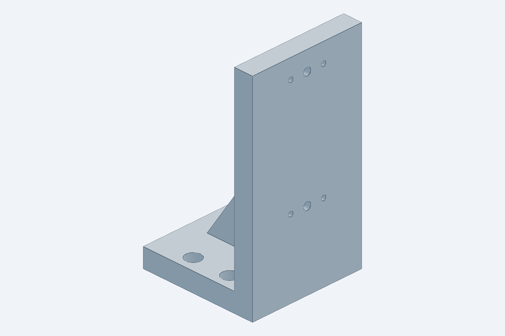
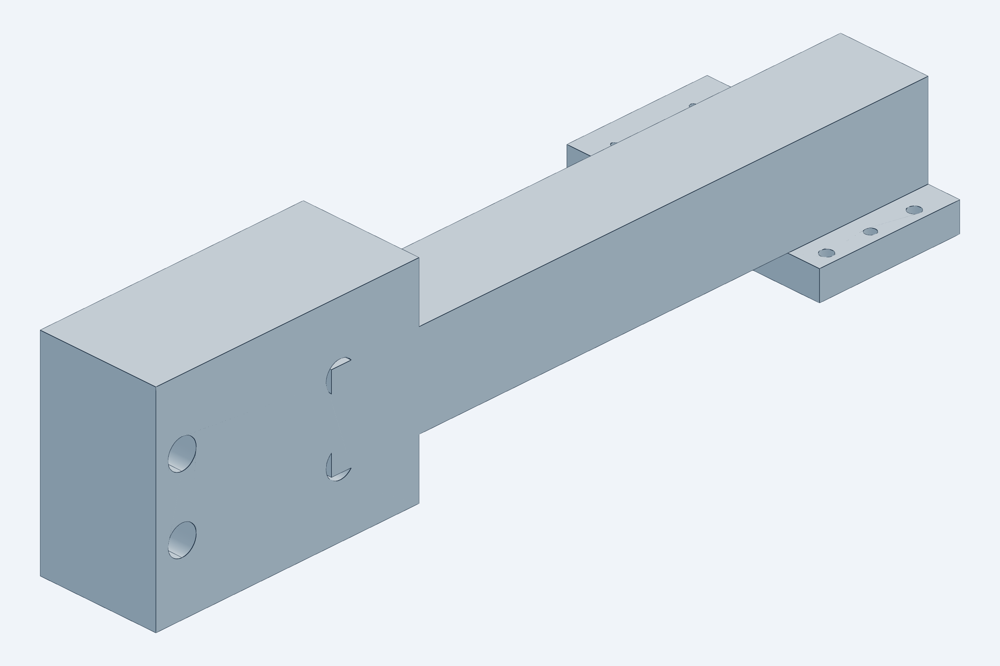
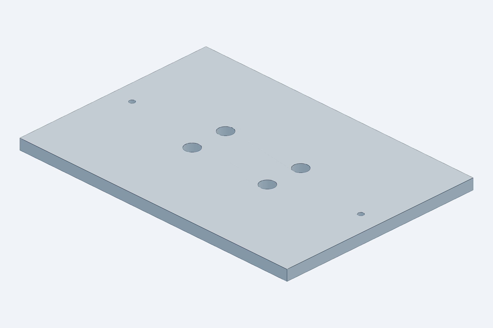
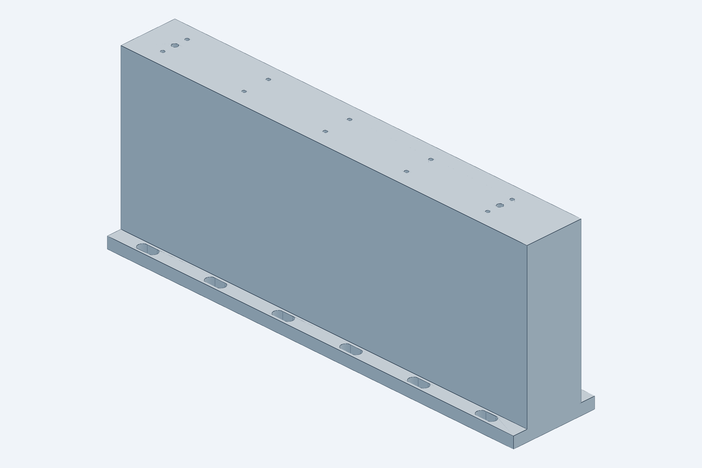
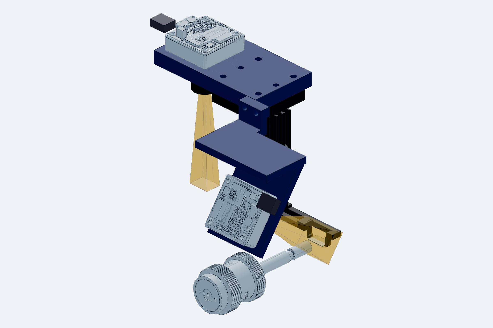
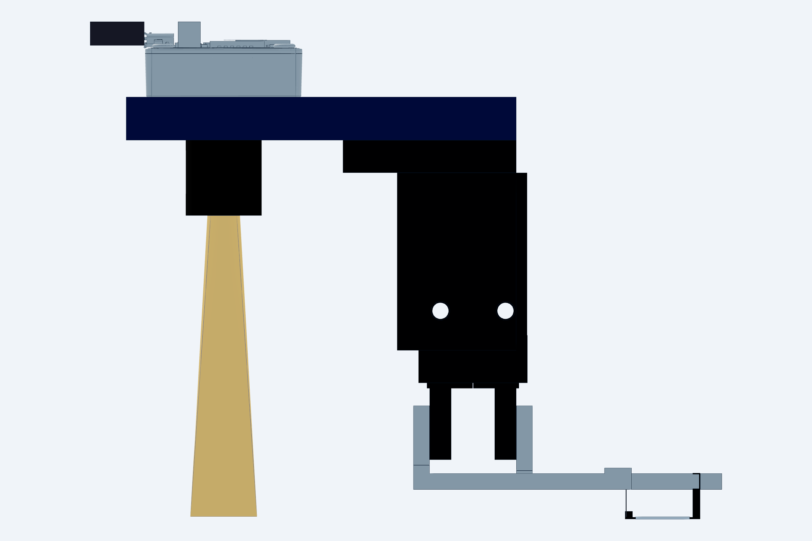

# Full station assembly: layout, movement pattern, compatibility

`model.py` (CadQuery) → `STEP/station_assembly[_h].step` (git-ignored, ~100 MB), `checks[_h].txt`, `renders/`.
Rebuild with `python cad/build.py` (builds the default and the `_h` horizontal-gripper variant). Manufacturer
STEP from `cad/vendor` is placed wherever the file exists and the envelope is used otherwise, so a clone
without the vendor files still builds and checks; the first line of `checks.txt` lists the
vendor files that were placed. Imports `cad/gripper`, `cad/nest`, `cad/tray` and `cad/common`; this file
only **places** the components and adds the transport axes, the two NanoMax fiber stages with holder
envelopes, the microscope envelope and the table, then computes the clearances.

## Manufacturer models

| Part | File in `cad/vendor` | Status |
|---|---|---|
| Thorlabs NanoMax 300, MAX313D/M (×2) | `thorlabs_MAX313D_M.step` | **placed**; the input stage is rotated −90° so its Z micrometer (46 mm out of the +X face) points −Y and its Y micrometers +X. A left-handed NanoMax would allow the mirror layout. |
| Thorlabs KB1X1 kinematic base | `thorlabs_KB1X1.step` | **placed** under the nest riser (25.4 × 25.4 × 12.7 mm assembled) |
| MISUMI **LX2005CG-B1-A2040-300** (X), **-200** (Y), **-100** (Z) single-axis actuators | `misumi_LX2005CG-B1-A2040-{300,200,100}.step` | **placed** (`lx_file_members()`: body with the motor-bracket casting + cover strip, table plate, adapter plate + screws; the motor is an envelope on the plate). The files confirmed the catalog reading: 40 wide × 26.5 tall body, 52 × 57 table plate to 27 above the rail bottom, screw axis at 13, bracket casting 56 beyond the rail, 40 × 40 × 13 adapter plate hanging 7 mm below the rail. Effective stroke = L − 63.5. The uploaded files carry the A2040 (□40 servo) adapter plate; the actuators are ordered with the T2042 plate for the Oriental Motor AZM46 steppers (decided; same outline). |
| SMC MHZ2-6D-M9N | `smc_MHZ2-6D.step` | **placed** through `cad/gripper` (fingers set from the drawn open position to closed) |
| Suruga KXC04015-C X stage | `suruga_KXC04015-C.step` | **placed** through `cad/nest` (motor and cable toward −X; `checks.txt` checks base, table, motor and cable loop per member) |
| MISUMI RMPG40W-N motorized rotary | `misumi_RMPG40W-N.step` | **placed** through `cad/nest` on top of the X stage (motor toward −X, long end toward −Y; straight vendor cable cut at a 40 mm lead-out; rides ±7.5 mm with the stage). The earlier RMPG60ZC-N upload is the vertical-axis type and is not used |
| Microscope objective / tube / column | — | envelope (`common.OBJ_WD`, `OBJ_DIA`, `TUBE_DIA`); measure |

The Velmex BiSlide files (`velmex_MN10-*.step`) are no longer used: the transport was re-sized to what the
handling needs (±0.15 mm at the nest, ±0.3 mm at the tray, ±0.05 mm in Z, every position approached from the
same side) and moved to the LX20 class for cost and speed; see `docs/bom_month1.md` A1.

## Layout (frame: X = die long axis, Y = optical axis, Z up, die bottom at nest = 0)

| Element | Position | Why |
|---|---|---|
| Optical table plane | Z −111 | NanoMax on a 25 mm riser + deck 62.5 + platform 4 + holder 20 puts the fiber axis at die-top height (Z 0.5); the riser exists because the die-stage stack needs 100 mm under the die. |
| Nest (`cad/nest`) on its **die stage** | T-riser neck X −8…18, Y −2…8 down to Z −12, 38 × 38 wide body to Z −22.3 on a **MISUMI RMPG40W-N** motorized rotary (axis through the die, motor toward −X, body toward −Y, on an 8 mm spacer) on a **Suruga KXC04015-C** X stage (±7.5 mm, motor toward −X) on a KB1X1; copper chuck; Semitron cage X −2.5…12.5, Y −2…8 | Narrow at the top so both fiber corridors stay open; the nest steps the die from device to device under fixed fibers; the rotary above the travel nulls the fiducial-to-fiducial yaw; the gripper meets it at stage home only. |
| NanoMax 300 (input / output) on 25 mm risers | inner faces 45 mm from the facets: Y −157…−45 and Y 51…163; X −51…61 | Fiber holders reach in from the platforms; holder fronts 5 mm from the facets. |
| Microscope | objective Ø34 centred on the die, front lens at WD 20; Ø40 tube above; arm to a Ø40 column at **X = 80** | Behind the nest, as on the bench. |
| **X actuator** (LX2005CG L 300, stroke 236.5; 208.7 used) | along X, centre-line **Y = −165**; rail X −385…−85 with its bottom at Z 7.2 on a **118 mm riser bar** (40 wide, under the base rail; the bracket casting, adapter plate and motor overhang to X −544) | Its riser flange (Y −195…−135) lies beside the tray's Y sweep and beside the input NanoMax (X ≥ −51), so nothing passes under it and the riser is one bar, no bridge. At Y −165 (moved out from −140, rev. 2.13) the deck clears the flange by 33.5 mm at row 0 and by 14 mm at the end of the Y actuator's physical stroke, so a lost soft limit cannot drive the deck into the riser (checks "@Y stroke end"). Travel margins 25.3 mm at the far column, 2.5 mm after the push-to-stop. |
| **Z actuator** (LX2005CG L 100, stroke 36.5; 20 used) | vertical on a 60 × 60 × 10 angle bracket bolted to the X table plate (4 × M4); rail mounting face on the bracket's +X leg, rail Z 44…144, adapter plate and brake motor up to Z ≈ 303; table plate centre at Z 90.5 at the nest (76…112.5 available) | Only 8 mm lift + 12 mm drop are needed; the ball screw back-drives, hence the brake motor (or a pneumatic slide, see the design note). |
| **Arm** | one piece: 33-deep adapter block on the Z table plate (4 × M4 counterbored + 2 dowels), 25 mm square bar along +Y from the axis band to the die line at Z 78–103, 8 mm end plate over the gripper interface (`gripper.IFACE`) at Z 70–78 | X-table centre at the nest is **−121**: the bar starts exactly at the interface's −X edge, so there is no bar along X and no drop bar. Nothing of the arm enters the objective footprint. Static moment on the X table 0.9 N·m against 27 allowable. |
| **Gripper module** (`cad/gripper`) | actuator body X −40…−20, Y −2…8; bars 5 mm above the die | Only the two 3 mm bars and the tip blocks enter the objective footprint. |
| **Y actuator** (LX2005CG L 200, stroke 136.5; 97.5 used) + **wafer tray** (`cad/tray`) | along Y under the tray at X −146 (tray centre), rail Y −97…+103, motor toward +Y (adapter plate to Y 172, motor envelope to 262); rail bottom at Z −48 on a **63 mm riser bar**; deck on the table plate, tray ledges at **Z −12** | Columns at die X −95 … −207 (16 mm pitch), rows at 7.5 mm pitch; X selects the column, Y the row. Column 0 sits where the tray's +X rim and the deck clear the input NanoMax base as the rows sweep. Travel margin 19.5 mm beyond both end rows; the deck (tray + 8 in X, + 2 in Y) is checked at both physical stroke ends, and the LX20 limit-sensor set on this rail is the hard backstop to the absolute encoder's soft limits. |

`checks.txt` prints the derived numbers (rail positions, travel margins at both ends of every actuator, the
static moment on the X table plate against the LX20's 27 N·m rating, the exchange time at 200 mm/s).

## Custom mounting parts (`STEP/`, `STL/`)

The pieces between the actuators and everything else are real parts with bolt patterns (measured in the
LX20 STEP files: base holes Ø3.4 in two rows 18 mm apart on a 60 mm pitch, table plate 4 × M4 on 20 × 45 with
two Ø3 dowels) and are exported per part; the printing and finishing instructions are in
[`docs/print_list.md`](../../docs/print_list.md). Hole sizes are tap-drill / press-fit for printing.

| File | Part | Interfaces |
|---|---|---|
| `x_axis_riser_6061[_h]` | riser bar under the X actuator: 40 wide body from the table to the rail bottom, 60 × 8 foot flange with 6.6 × 14 slots on a 50 mm pitch | top: 10 × M3 tap-drill + 2 × Ø4 pin holes on the LX20 base pattern; foot: M6 or ¼-20 on a 25 mm / 1″ grid |
| `y_axis_riser_6061` | same under the Y actuator (80 wide flange) | 6 × M3 + 2 × Ø4; foot slots |
| `tower_bracket_6061` | 60 × 60 × 10 base on the X table plate, 10 mm leg carrying the Z rail, gusset rib | base: 4 × Ø4.5 counterbored + 2 × Ø3 dowels (table pattern); leg: 4 × M3 tap-drill + 2 × Ø4 pins (Z rail base pattern) |
| `arm_6061[_h]` | one piece: 33-deep adapter block on the Z table plate, 25 sq bar along +Y, 8 mm end plate over the gripper bracket | block: 4 × Ø4.5 counterbored Ø8 from the outside + 2 × Ø3 dowels; end plate: 4 × M4 tap-drill + 2 × Ø3 dowels on `gripper.IFACE` |
| `tray_deck_6061` | flat 6 mm deck on the Y table plate; two Ø3 m6 dowel pins 3.0 mm proud locate the tray (round hole in the −X rim, 4.5 mm slot along X in the +X rim, 0.05 mm clearance per side; `tray.datum_pins()`), gravity holds it | 4 × Ø4.5 counterbored from the top + 2 × Ø3 dowels (table pattern); 2 × Ø3 H7 pin holes |
| `nanomax_riser_6061` (×2) | 25 mm plate under each NanoMax | 16 × Ø6.6 through on the 25 mm grid (M6 bolts through the stage slots into the table) |

The arm end plate is extended from the gripper interface (X −56) to X −94 in the vertical layout to carry the tray
camera (next section); the `_h` layout keeps the short plate and has no camera yet.

## Tray camera on the arm (`SN` in `model.py`, envelopes in `common.SENSORS`)

The gripper is blind by itself; a small camera on the arm end plate makes the tray survey an X-Y raster with the
transport axes at the +8 mm traverse height (`docs/pick_and_place_design.md` §3.5, §3.6):

| Sensor | Part | Where (gripper frame) | What it gives |
|---|---|---|---|
| Camera | **Basler dart daA1440-220um S-mount** (IMX273 global shutter 1440 × 1080, 3.45 µm, USB3, pypylon, 15 g) + 12 mm M12 lens on a 3 mm spacer ring (a board lens is sold focused near infinity with a 100–200 mm minimum object distance; 3.3 mm of extension focuses it at 56 mm, magnification 0.28, depth of field ≈ 1 mm at f/4) | hung under the end plate by its four board holes, optical axis 76 mm behind the die origin on the pick line (X −76, Y 3), lens front 36 above the jaws' die-bottom plane | at the traverse height a tray die top is 55.5 mm away: field 18 × 14 mm, 12.5 µm/px, one pocket per frame. Pocket occupied / empty, die orientation from a fiducial, chipped corners, the die's Y offset in the pocket to ±0.05 mm so the pick can be corrected, and the die's height from its apparent size (a 0.1 mm Z change scales the 800-pixel die image by 1.4 px; ±0.02 mm with sub-pixel edges after a one-time lens calibration). Column 0 is imaged with the jaws at die X −19 (inside the exchange envelope), the far column at −131 |

The camera body (X −91…−61, Y −12…18, Z 50…70, lens to Z 36) sits between the arm bar and the actuator, 7.4 mm from the gripper
bracket's top plate and 21 mm from the actuator body; nothing is added near the jaws. At the nest it is 63 mm above the
input NanoMax and clear of the holders and the objective; at the far column it is beside the tower (no Y overlap) and
50 mm above the deck (`checks.txt`, "tray sensors" lines). Added mass ≈ 0.05 kg. The USB3 micro-B cable runs along the
arm bar to the tower.

**Laser displacement sensor: modelled and rejected.** A Panasonic HG-C1030 (30 ± 5 mm, 10 µm; 20 × 44 × 25 mm, 35 g)
on a 60 mm drop bracket was placed beside the actuator (`SN["laser"] = True` re-creates it: beam 61 mm behind the jaws,
emitting face 10 mm above the die-bottom plane so the ledge plane is at its reference at the traverse height). It
cleared everything (5.7 mm to the gripper bracket) but is as large as the actuator itself, hangs 60 mm below the plate
beside the jaws, and would ride 61 mm from the jaws on the same rails, so it cannot see the rail-pitch part of the jaw
height error anyway. Z across the tray is handled instead by a machined deck, an SLA or machined tray, the pins, a
touch-off per tray type with the jaws, the camera's size-based height check and a ±0.15 mm pick window
(`docs/pick_and_place_design.md` §3.5). Alternatives looked at: Keyence IL-030 + IL-1000 (1 µm, ~3× the price,
separate amplifier, same size head), Micro-Epsilon optoNCDT 1220-10 (3.7 µm, €470+, 46 × 40 mm body); no
displacement sensor in the 10 µm class is much smaller than 20 × 40 mm, because the triangulation baseline sets the size.

**Envelopes, not vendor geometry yet.** The dart body is the manufacturer's outline (29.3 × 29 × 19.9); its
mounting-hole pattern (assumed 4 × M2 on 22 × 22) and USB plug position are **assumptions** flagged in
`common.SENSORS`; place the Basler STEP in `cad/vendor` and re-check before the plate holes are made. Camera
alternatives: FLIR Blackfly S board-level (29 × 29 × 30, $371), Arducam IMX296 UVC module (~$120, no SDK); the dart has
the smallest housing and a Python SDK.

## Movement pattern (one exchange)

Coordinates are X-table centre / Z-table height of the arm bar / Y-stage pocket position.
Fibers are only ever moved by their own NanoMax stages.

| Step | Axis | From → to | Interlock |
|---|---|---|---|
| 0 | die stage X (KXC04015) | nest to its **home** position (stage origin sensor) | home flag set; the gripper never enters otherwise |
| 1 | NanoMax Y (both) | fibers retract 1.0 mm along ±Y | fibers-retracted flag set |
| 2 | Z | +8 mm (arm end plate Z 70 → 78), gripper open | fibers retracted, objective gap ≥ 11 mm |
| 3 | Z | −8 mm: noses descend beside the die's end faces | — |
| 4 | gripper | close (finger-on-finger stop; 0.32 N on the die) | — |
| 5 | nest | chuck vacuum off; **Z +8 mm** lifts the die | vacuum switch reads atmosphere |
| 6 | X | −121 → −216 … **−328** (column *c* of the tray: 95 + 16·c mm along the die's long axis) | Z at +8 |
| 7 | Y stage | brings row *r* to Y = 3 (±48.75 mm) | can pre-position during step 6 |
| 8 | Z | −8 −12 mm: die onto the pocket ledges (12 mm below nest height) | — |
| 9 | gripper | open (+1.5 mm per side) | — |
| 10 | Z | +20 mm; then steps 6–9 in reverse with the next die, arriving at the nest with the die's +X end face **0.2 mm short of the stop pads** | — |
| 11 | Z, gripper | Z −8 mm: die onto the chuck pad; jaws open (+1.5 mm per side) | — |
| 12 | X | **push-to-stop: gripper +1.7 mm** — the open near nose meets the die's −X end face, slides it 0.2 mm onto the two +X pads and overtravels 0.1 mm, so the blade limits the push to 0.25 N; X and yaw are now mechanical | — |
| 13 | nest, X, Z | chuck vacuum on (seat detection); gripper −1.7 mm, Z +8 mm, X out to the park position; camera pose check; fibers approach | vacuum switch reads seated |
| 14 | die stage X, θ | yaw trim: X to the fiducial at one die end, then to the other, camera reads the lateral offset, θ rotates it out (repeat once); then X steps the die ±4 mm to bring each device under the fibers (fibers realign per device; the stage stays inside the fence while the gripper is parked) | gripper parked |

Exchange time budget: ~8 s; the two X moves of 207 mm at 200 mm/s take ~1.3 s each, the rest is Z, the
jaw cycles and the vacuum settling.

## Compatibility results (`checks.txt`, vendor files placed)

All pairs are OK or TIGHT-by-design. Intended non-OK lines: the gripper band sweep passes under the
objective (that *is* the exchange; the bar-height check is `cad/gripper/checks.txt`), the stop pads touch
the seated die, and the fiber envelope 1.9 mm above the cage plate.

- **Microscope:** finger bars 12.0 mm below the objective front lens (WD 20); near head 11.0 mm;
  actuator body 8 mm outside the barrel and 5 mm outside a Ø40 tube; arm end plate and bracket 7 mm
  outside the tube; nothing within 44 mm of the column. If the tube above the objective is wider than
  Ø40, move the actuator further out with `body_cx`; the arms lengthen by the same amount.
- **Fiber stages and holders:** gripper arms 3.2 mm from the holder bodies at the nest; the X rail's nest end
  25 mm from the input NanoMax base and its band beside it in Y; the tower and the arm pass above the NanoMax
  and the holders. The die's travel path (after the 8 mm lift) clears both holders and never crosses the fiber line.
- **Die stage:** every stack member 17 mm below the holder bodies, 10 mm from the input NanoMax base and 28 mm
  from the output one; both motors, toward −X, keep 87 mm and more to the microscope column; the moving nest
  keeps 3.0 mm to the holders at the travel ends.
- **Tray side:** tray rim 21 mm and deck 13 mm from the input NanoMax base at the extreme row; the deck 6 mm
  from the X band; the tower at the farthest column clear of the Y actuator, its riser and the X motor plate;
  travel margins ≥ 2.5 mm at every actuator end (printed in `checks.txt`). The tower base plate sits 0.5 mm above
  the X body (TIGHT by design: the table plate top stands 0.5 above the cover strip).

Real collisions the model found and the layout absorbed: NanoMax Z micrometer vs X axis (input stage
rotated −90°), riser vs the 5 mm-protrusion fiber holders (10 mm neck), and, in the Velmex layout this one
replaces, the Y stage passing under the X axis (two pedestals) and the horizontal arm through the X axis
(drop bar): both disappear with the X actuator's narrow band beside the tray sweep.

## Open dimensions to measure before ordering the risers and brackets

1. Fiber axis height above the NanoMax platform (`holder_axis_above_deck`, assumed 20): sets every riser height together with the 25 mm NanoMax riser (`common.NANOMAX_RISER`).
2. Objective working distance and the diameter of whatever sits above it (`common.OBJ_WD`, `TUBE_DIA`).
3. The real fiber holder (`common.FIBER`).
4. The AZM46 motor bodies on each LX20 (the model's motor envelope is 42 sq × 90 long, which covers the AZM46MK brake motor on Z and the AZM46AK on X and Y with margin) and their cable exits.
5. KXC04015 and RMPG40W-N bolt patterns for the two adapter plates (from their STEP files); the KB1X1 platform pattern.
