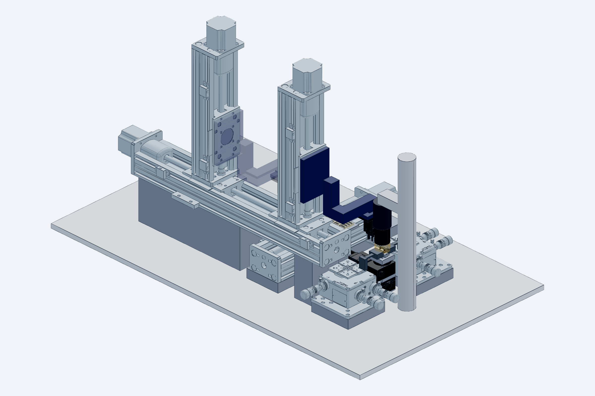
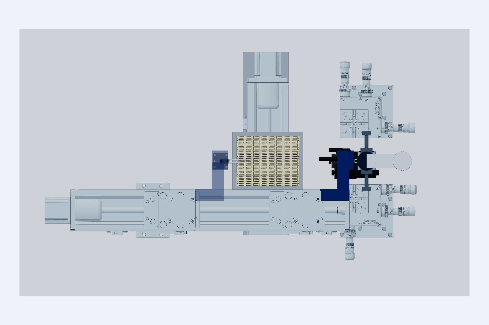
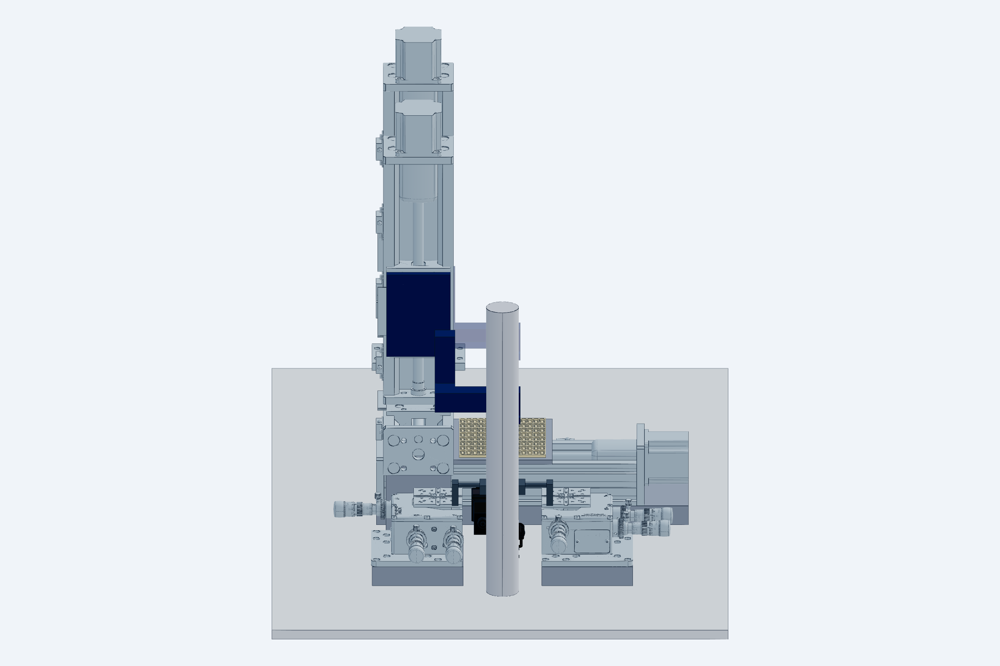

# Full station assembly: layout, movement pattern, compatibility

`model.py` (CadQuery) → `STEP/station_assembly[_h].step` (git-ignored, ~100 MB), `checks[_h].txt`, `renders/`.
Rebuild with `python cad/build.py` (builds the default and the `_h` horizontal-gripper variant). Manufacturer
STEP from `cad/vendor` is placed wherever the file exists and the envelope is used otherwise, so a clone
without the git-ignored vendor files still builds and checks; the first line of `checks.txt` lists the
vendor files that were placed. Imports `cad/gripper`, `cad/nest`, `cad/tray` and `cad/common`; this file
only **places** the components and adds the transport axes, the two NanoMax fiber stages with holder
envelopes, the microscope envelope and the table, then computes the clearances.

## Manufacturer models

| Part | File in `cad/vendor` | Status |
|---|---|---|
| Thorlabs NanoMax 300, MAX313D/M (×2) | `thorlabs_MAX313D_M.step` | **placed**; the input stage is rotated −90° so its Z micrometer (46 mm out of the +X face) points −Y and its Y micrometers +X, keeping 9 mm to the X axis. A 180° rotation would put that micrometer 37 mm into the X axis. A left-handed NanoMax would allow the mirror layout. |
| Thorlabs KB1X1 kinematic base | `thorlabs_KB1X1.step` | **placed** under the nest riser (25.4 × 25.4 × 12.7 mm assembled) |
| Velmex BiSlide **MN10-0150-M02-21** (X) | `velmex_MN10-0150-21.step` | **placed**: body 86.4 × 54.6 mm, slider top 65.1 above the body bottom, 117 mm slider, PK266 motor adds 64 mm beyond the far (−X) end; body's nest end at X −40, riser 86 mm as **two pedestals** with a gap X −285…−120 where the Y stage and the tray deck pass under the axis; cleats relocated 120 mm toward the motor end |
| Velmex BiSlide **MN10-0050-M02-21** (Z) | `velmex_MN10-0050-21.step` | **placed** vertically on the X slider, motor up (tower top Z ≈ 450); slider parked 20 mm above its low limit, adapter plate + 25 mm drop bar to the arm level |
| Velmex BiSlide **MN10-0050-M02-21** (Y) | same file | **placed** under the tray, body Y −152…+168, motor toward +Y; slider top 65.1 above the table so the tray ledges sit 11.9 mm below nest height |
| SMC MHZ2-6D-M9N | `smc_MHZ2-6D.step` | **placed** through `cad/gripper` (fingers set from the drawn open position to closed) |
| Suruga KXC04015-C X stage | `suruga_KXC04015-C.step` | **placed** through `cad/nest` (motor and cable toward −X; `checks.txt` checks base, table, motor and cable loop per member) |
| MISUMI RMPG40W-N motorized rotary | `misumi_RMPG40W-N.step` | **placed** through `cad/nest` on top of the X stage (motor toward −X, long end toward −Y; straight vendor cable cut at a 40 mm lead-out; rides ±7.5 mm with the stage). The earlier RMPG60ZC-N upload is the vertical-axis type and is not used |
| Microscope objective / tube / column | — | envelope (`common.OBJ_WD`, `OBJ_DIA`, `TUBE_DIA`); measure |

## Layout (frame: X = die long axis, Y = optical axis, Z up, die bottom at nest = 0)

| Element | Position | Why |
|---|---|---|
| Optical table plane | Z −111 | NanoMax on a 25 mm riser + deck 62.5 + platform 4 + holder 20 puts the fiber axis at die-top height (Z 0.5); the riser exists because the die-stage stack needs 100 mm under the die. |
| Nest (`cad/nest`) on its **die stage** | T-riser neck X −8…18, Y −2…8 down to Z −12, 38 × 38 wide body to Z −22.3 on a **MISUMI RMPG40W-N** motorized rotary (axis through the die, motor toward −X, body toward −Y, on an 8 mm spacer) on a **Suruga KXC04015-C** X stage (±7.5 mm, motor toward −X) on a KB1X1; copper chuck; Semitron cage X −2.5…12.5, Y −2…8 | Narrow at the top so both fiber corridors stay open; the nest steps the die from device to device under fixed fibers; the rotary above the travel nulls the fiducial-to-fiducial yaw; the gripper meets it at stage home only. |
| NanoMax 300 (input / output) on 25 mm risers | inner faces 45 mm from the facets: Y −157…−45 and Y 51…163; X −51…61 | Fiber holders reach in from the platforms; holder fronts 5 mm from the facets. |
| Microscope | objective Ø34 centred on the die, front lens at WD 20; Ø40 tube above; arm to a Ø40 column at **X = 80** | Behind the nest, as on the bench. |
| **X axis** (MN10-0150, 381 mm travel; 262 used) | along X, centre-line **Y = −100**, on a **111 mm riser** (two pedestals) so the body sits at Z 0…55, above the NanoMax envelope and above the tray deck that crosses under it; body X −604…−40, motor to X −668 | Beside the input fiber stage, outside the fiber corridor, above the stage's protruding actuators. |
| **Z axis** (MN10-0050, 127 mm travel; 20 used) | vertical on the X slider; nest position carriage centre X −140 (arm reach 140 mm, so the real slider stays inside its travel at the nest) | 77 mm clearance to the NanoMax in the other Y band. |
| **Arm** | 25 mm square L-bar from the Z carriage: crosses the X-axis band at Z ≥ 82 (`arm_cross_z`), +Y from the axis band to the die line; end plate over the gripper interface (`gripper.IFACE`) at Z 70–78 | Passes 7 mm outside the Ø40 tube; nothing of it enters the objective footprint. |
| **Gripper module** (`cad/gripper`) | actuator body X −40…−20, Y −2…8; bars 5 mm above the die | Only the two 3 mm bars and the tip blocks enter the objective footprint. |
| **Y stage** (105 mm travel, on a 25 mm riser) + **wafer tray** (`cad/tray`) | tray on the Y-stage deck; columns at die X −150 … −262 (16 mm pitch), rows at 7.5 mm pitch; X selects the column, Y the row | Dies return to their own pocket; the gripper never crosses the fiber line; the riser keeps the tray 11.9 mm below nest height. |

## Movement pattern (one exchange)

Coordinates are X-carriage centre / Z-carriage height of the arm end plate / Y-stage pocket position.
Fibers are only ever moved by their own NanoMax stages.

| Step | Axis | From → to | Interlock |
|---|---|---|---|
| 0 | die stage X (KXC04015) | nest to its **home** position (stage origin sensor) | home flag set; the gripper never enters otherwise |
| 1 | NanoMax Y (both) | fibers retract 1.0 mm along ±Y | fibers-retracted flag set |
| 2 | Z | +8 mm (arm end plate Z 70 → 78), gripper open | fibers retracted, objective gap ≥ 11 mm |
| 3 | Z | −8 mm: noses descend beside the die's end faces | — |
| 4 | gripper | close (finger-on-finger stop; 0.32 N on the die) | — |
| 5 | nest | chuck vacuum off; **Z +8 mm** lifts the die | vacuum switch reads atmosphere |
| 6 | X | −140 → −290 … **−402** (column *c* of the tray: 150 + 16·c mm along the die's long axis) | Z at +8 |
| 7 | Y stage | brings row *r* to Y = 3 (±48.75 mm) | can pre-position during step 6 |
| 8 | Z | −8 −11.9 mm: die onto the pocket ledges (11.9 mm below nest height) | — |
| 9 | gripper | open (+1.5 mm per side) | — |
| 10 | Z | +19.9 mm; then steps 6–9 in reverse with the next die, arriving at the nest with the die's +X end face **0.2 mm short of the stop pads** | — |
| 11 | Z, gripper | Z −8 mm: die onto the chuck pad; jaws open (+1.5 mm per side) | — |
| 12 | X | **push-to-stop: gripper +1.7 mm** — the open near nose meets the die's −X end face, slides it 0.2 mm onto the two +X pads and overtravels 0.1 mm, so the blade limits the push to 0.25 N; X and yaw are now mechanical | — |
| 13 | nest, X, Z | chuck vacuum on (seat detection); gripper −1.7 mm, Z +8 mm, X out to the park position; camera pose check; fibers approach | vacuum switch reads seated |
| 14 | die stage X, θ | yaw trim: X to the fiducial at one die end, then to the other, camera reads the lateral offset, θ rotates it out (repeat once); then X steps the die ±4 mm to bring each device under the fibers (fibers realign per device; the stage stays inside the fence while the gripper is parked) | gripper parked |

Exchange time budget: ~20 s with lead-screw stages at 20 mm/s; the X move dominates.

## Compatibility results (`checks.txt`, vendor files placed)

All pairs are OK or TIGHT-by-design. Intended non-OK lines: the gripper band sweep passes under the
objective (that *is* the exchange; the bar-height check is `cad/gripper/checks.txt`), the stop pads touch
the seated die, and the fiber envelope 1.9 mm above the cage plate.

- **Microscope:** finger bars 12.0 mm below the objective front lens (WD 20); near head 11.0 mm;
  actuator body 8 mm outside the barrel and 5 mm outside a Ø40 tube; arm end plate and bracket 7 mm
  outside the tube; nothing within 44 mm of the column. If the tube above the objective is wider than
  Ø40, move the actuator further out with `body_cx`; the arms lengthen by the same amount.
- **Fiber stages and holders:** gripper arms 3.2 mm from the holder bodies at the nest; X axis 9 mm from
  the input NanoMax body and above its actuator zone; Z tower 77 mm from it. The die's travel path (after
  the 8 mm lift) clears both holders and never crosses the fiber line.
- **Die stage:** every stack member 17 mm below the holder bodies, 10 mm from the input NanoMax base and 28 mm
  from the output one; both motors, toward −X, keep 87 mm and more to the microscope column and 32 mm to the
  X-axis pedestal; the moving nest keeps 3.0 mm to the holders at the travel ends.
- **Tray side:** Z tower at the farthest column clear of the Y-stage body; the Y stage and the tray deck
  pass under the X axis between the two pedestals (11 / 8 mm at the extreme row); X travel used 262 of 381 mm.

Real collisions the model found and the layout absorbed: NanoMax Z micrometer vs X axis (input stage
rotated −90°), riser vs NanoMax base (pedestal ends 14 mm short), Y stage vs X-axis riser (two pedestals),
horizontal arm through the X axis (`arm_cross_z` + drop bar), SMC body vs Velmex cleat (cleats shifted),
riser vs the 5 mm-protrusion fiber holders (10 mm neck).

## Open dimensions to measure before ordering the axes and risers

1. Fiber axis height above the NanoMax platform (`holder_axis_above_deck`, assumed 20): sets every riser height together with the 25 mm NanoMax riser (`common.NANOMAX_RISER`).
2. Objective working distance and the diameter of whatever sits above it (`common.OBJ_WD`, `TUBE_DIA`).
3. The real fiber holder (`common.FIBER`).
4. Vendor carriage bolt patterns (Velmex) for the riser, tower bracket and arm end plate; RPG38 and KXC04015 bolt patterns for the two adapter plates.
