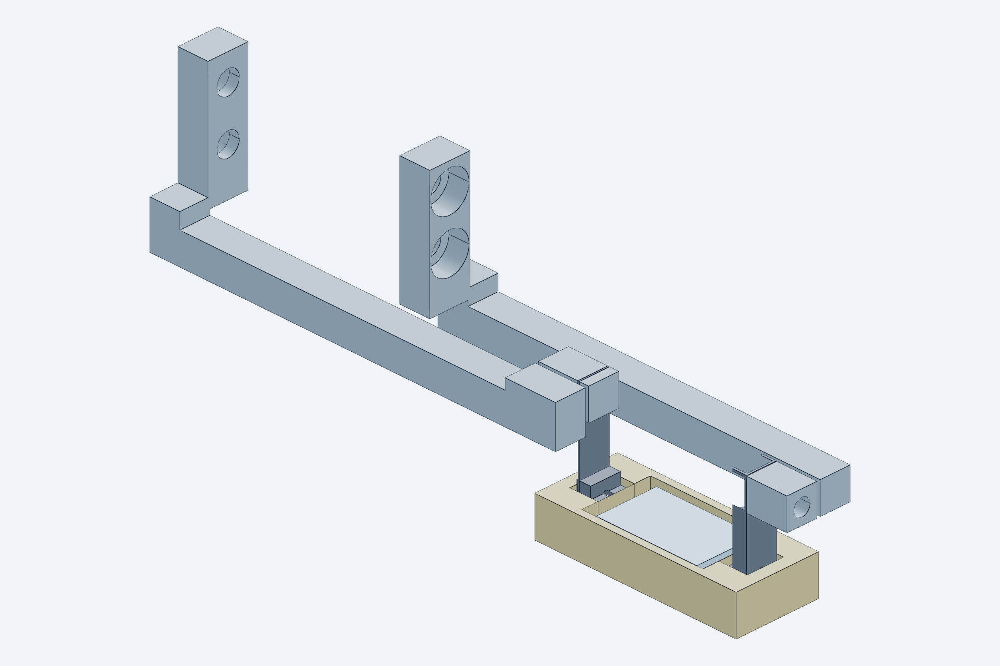
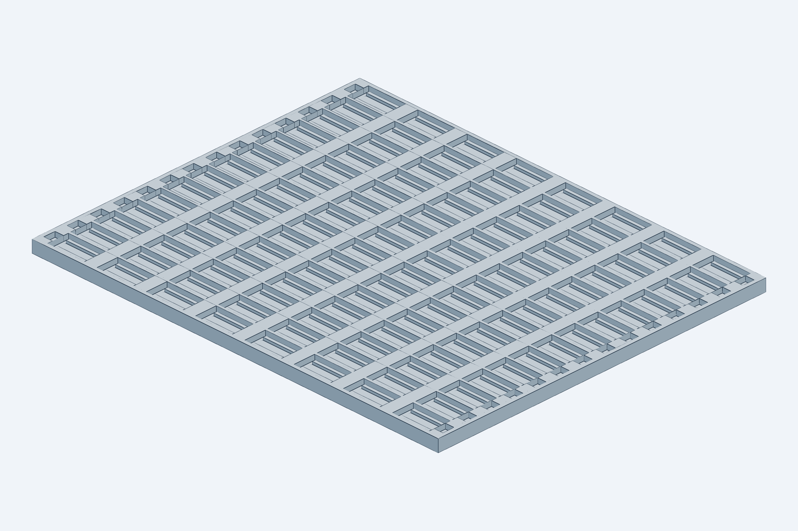

# Wafer tray

`model.py` (CadQuery) → `STL/wafer_tray_8x14.stl` (the print file), `STEP/tray_pocket_check.step`,
`renders/`, `checks.txt`; the full-tray STEP (5.6 MB) is git-ignored and regenerated by
`python cad/build.py`. Imports `cad/gripper` (open jaws for the pocket check) and `cad/common`. Used by
`cad/station` (`tray()`, `extents()`, `TR` for the column positions).

## Container assumption

One 4″ wafer (~100–112 dies of 10 × 6 mm, all in one orientation) = one tray of **8 columns × 14 rows
= 112 pockets** (132 × 106 × 3.8 mm). Pocket indices mirror the wafer map, so a die's identity is its
pocket and every die returns to its own pocket after test. Physical pass/fail binning is not done at the
tester; it is a map operation at the sorting station if ever needed. SLA printed (Formlabs Rigid 10K or
Protolabs Accura), lidded, DataMatrix on the rim; fits a Form 3 bed and a 5″ wafer box. A second tray
position along X would need +130 mm X travel (Month-2 option).

## Pocket geometry

Cavity 12.0 × 6.8 mm: the die is retained to ±1.0 mm in X by its four corners against the end walls and
±0.4 mm in Y, inside the open jaws' ±1.9 mm capture. Each end wall carries a 3.6 mm wide nose slot
(Y 1.2–4.8, the contact band ±0.3) for the open jaw tip blocks; with the 16 mm column pitch the slots of
neighbouring pockets meet, so the slot is a **through channel along each column** closed only by the tray
rims, into which it runs 2.8 mm (the open tip blocks reach 3.44 mm beyond the die origin; 0.37 mm clear).
Ledges 1.0 mm wide × 0.8 mm tall under the facet-edge strips carry the die; the walls end 0.3 mm above
the die top. Nothing touches the facets or the top surface.

`checks.txt` checks one end pocket (worst case, rims on both sides) against the die and against every
open-jaw part at the set-down height; the only non-OK lines are the two ledges at exactly 0 (they carry
the die).

## Station placement

In the station the tray rides on the Y-stage deck with columns along X (die X of column 0 at −150,
column 7 at −262) and rows along Y (7.5 mm pitch, ±48.75 mm of Y travel). The column positions
(`TR["col0_x"]`, pitches) are read by `cad/station`, so changing them here moves the transport
targets too.
