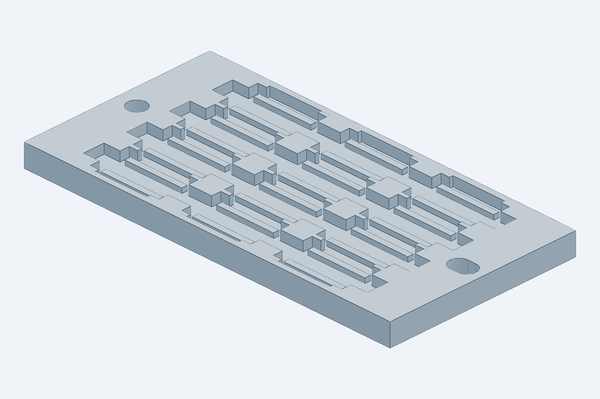

# Wafer tray

`model.py` (CadQuery) → `STL/wafer_tray_8x14.stl` (the print file), `STL/wafer_tray_coupon_3x4.stl` (the
print-test coupon), `STEP/tray_pocket_check.step`, `renders/`, `checks.txt`; the full-tray STEP (8.8 MB) is
tracked and regenerated by `python cad/build.py`. Imports `cad/gripper` (open jaws for the pocket check) and
`cad/common`. Used by `cad/station` (`tray()`, `extents()`, `TR` for the column positions).

## Print-test coupon (`wafer_tray_coupon_3x4`)

The same `tray()` generator run for `COUPON` = 3 columns × 4 rows (12 pockets, 64 × 32.5 × 3.8 mm) instead of
8 × 14, nothing else changed: same pockets, corner posts, reliefs, through channels, rims, and the full tray's
datum hole and slot (pin spacing 57 mm instead of 137). Three columns so the middle column has walls and the
channel on both sides, four rows so the middle rows have neighbours on both sides. Print it before the full
tray and check with pin gauges: cavity 12.0 × 6.8 (a die must drop in with ±1.0 / ±0.4 play), the 0.7 mm
corner posts, the 3.6 mm channel through every end wall, the ledge height (die top 0.3 below the wall top), and
the Ø3.1 hole / slot on two loose Ø3 pins. A pocket that comes out tight is corrected in the slicer (XY
compensation), not in the model. Rows 8–14 of the full tray add nothing the coupon does not test except
flatness, which is checked on the full print.

Presentation renders of a 3 × 3 patch (die stage frame, made with the scratch script kept out of the build; the
build renders above are the record): [empty pockets](../../docs/images/tray_pocket_empty.png),
[loaded](../../docs/images/tray_pocket_loaded.png), [release close-up](../../docs/images/tray_pocket_release_closeup.png)
and the release pose with the whole gripper module, [iso](../../docs/images/tray_pocket_release_gripper_iso.png) and
[along Y](../../docs/images/tray_pocket_release_gripper_front.png).

## Container assumption

One 4″ wafer (~100–112 dies of 10 × 6 mm, all in one orientation) = one tray of **8 columns × 14 rows
= 112 pockets** (144 × 108 × 3.8 mm). Pocket indices mirror the wafer map, so a die's identity is its
pocket and every die returns to its own pocket after test. Physical pass/fail binning is not done at the
tester; it is a map operation at the sorting station if ever needed. SLA printed (Formlabs Rigid 10K or
Protolabs Accura), lidded, DataMatrix on the rim; 144 × 108 mm with the datum rims, so it fits a Form 3 / Form 4 bed and a
6″ wafer box (not a 5″ one). A second tray
position along X would need +130 mm X travel (Month-2 option).

## Pocket geometry (corner-post pocket)

Cavity 12.0 × 6.8 mm. In X the die is retained to ±1.0 mm by its four corners against the **end walls**
(inside the open jaws' ±1.9 mm capture). In Y it is retained to ±0.4 mm by **four corner posts** only:
0.7 mm thick wall stubs 1.5 mm long at the die ends (X −1.0…0.5 and 9.5…11.0), the same idea as the
nest's corner guards. Between the posts the ±Y walls are **relieved to 1.0 mm from the facets** over
X 0.5…9.5; with the 7.5 mm row pitch the 0.7 mm wall between rows vanishes there, so along the whole
waveguide region (X 1…9) a facet faces open air and can touch nothing. A facet can only ever meet a post
within 0.5 mm of a die corner, outside the fiber positions. The edge rows keep a 1.0 mm outer rim beyond
the relief (`rim_y` 1.25).

Each end wall carries a 3.6 mm wide nose slot (Y 1.2–4.8, the contact band ±0.3) for the open jaw tip
blocks. With the 16 mm column pitch the slots of neighbouring pockets meet, so the slot is modelled as
**one through channel per row** (`slot_channel()`), closed only by the tray rims, into which it runs 2.8 mm
(the open tip blocks reach 3.44 mm beyond the die origin; 0.36 mm clear). It is one box per row on purpose:
cutting the per-pocket slot boxes as a single compound tool made OpenCascade silently drop the overlapping
members, and the earlier trays only had the notch at the two outer rims. The reliefs are cut one column at
a time for the same reason. Ledges 1.0 mm wide × 0.8 mm tall under the facet-edge strips carry the die; the
walls end 0.3 mm above the die top. Nothing touches the facets or the top surface.

**X play.** ±1.0 mm is kept for the printed (PPA-CF / SLA) trays, where a pocket can vary by a few tenths
and a tighter cavity risks a die wedging on an end wall during set-down; the jaws re-centre the die on
every pick. For a machined tray the cavity can go to 11.0 mm (±0.5 mm) by changing `cav_x` alone, together
with a tighter deck locating pocket.

`checks.txt` checks one end pocket (worst case, rims on both sides) against the die and against every
open-jaw part at the set-down height, with the corner posts and the relieved outer rims as separate
members. The only non-OK lines are the two ledges at exactly 0 (they carry the die) and the end walls
0.30 mm from the open tip blocks and blade (the nose slot's designed side clearance).

## Location on the deck: two pins

The tray drops onto two Ø3 dowel pins pressed into the flat deck (`cad/station`, `tray_pin`), 3.0 mm proud so they stay
below the tray's wall top and nothing above the deck can meet them. The −X rim has a round Ø3.1 hole, the +X rim a
3.1 × 4.5 slot along X (`datum_hole`, `datum_slot`, 3.5 mm in from the rim faces on the tray's Y centre line;
`datum_pins()` gives the positions, which the deck imports). The 0.05 mm clearance per side sets the placement
repeatability: ±0.05 mm in X and Y and 0.7 mrad of yaw over the 137 mm pin spacing (±0.05 mm at the far pockets),
inside the noses' 0.30 mm side clearance in the slot channel and the pocket's ±0.4 mm Y retention. Gravity holds the
tray; a spring plunger against the +X rim is an option if the Y moves ever prove to shift it. The X rims are 10 mm
wide beyond the end walls to carry the holes (`rim_x` 11 / 21 from the die origins). The pins fix X, Y and yaw; Z is
a taught map (see `docs/pick_and_place_design.md` §3.5).

## Station placement

In the station the tray rides on the deck of the Y actuator with columns along X (die X of column 0 at −95,
column 7 at −207) and rows along Y (7.5 mm pitch, ±48.75 mm of Y travel); the ledges sit 12 mm below the
chuck pad. Column 0 is set by the tray's +X rim (col 0 + 15) and the deck (+8) clearing the input NanoMax
base at X −51 as the rows sweep through its Y band (21 / 13 mm). The column positions (`TR["col0_x"]`,
pitches) are read by `cad/station`, so changing them here moves the transport targets too.
