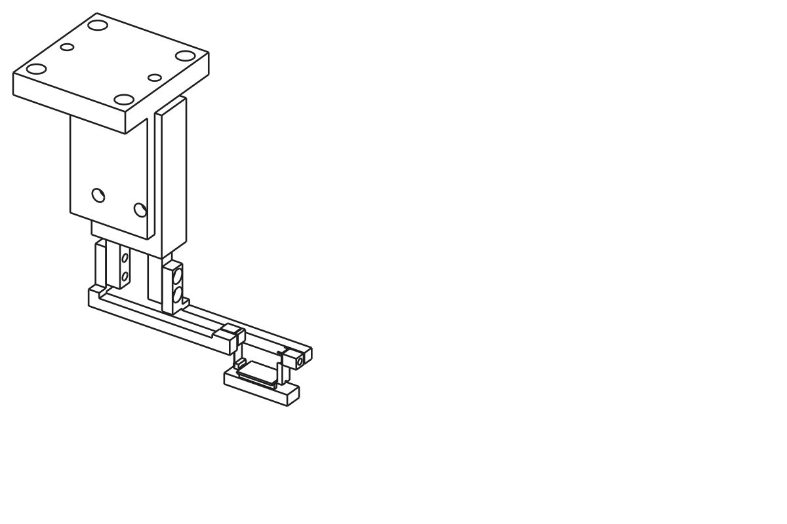
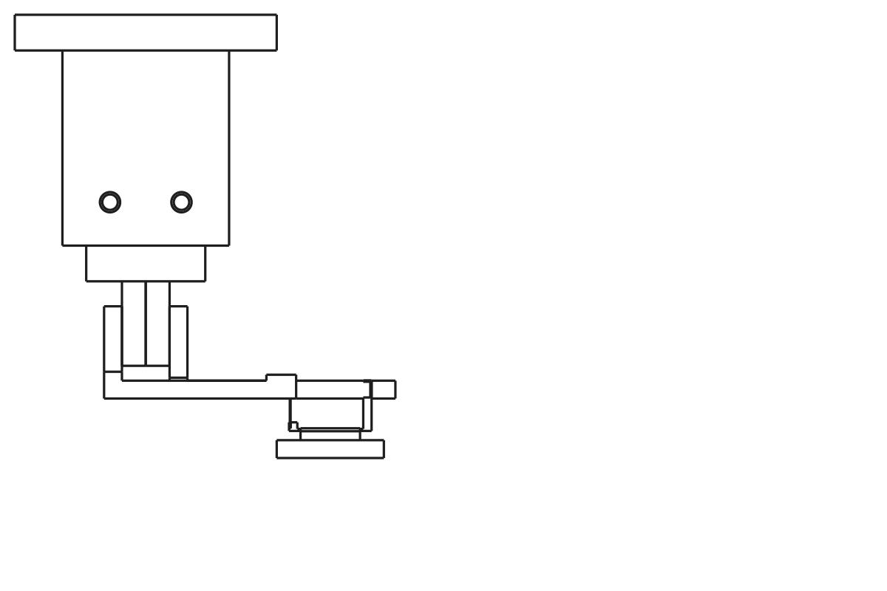
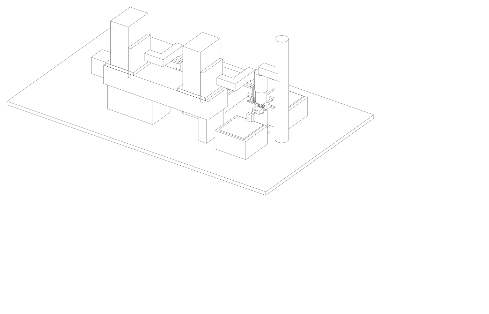
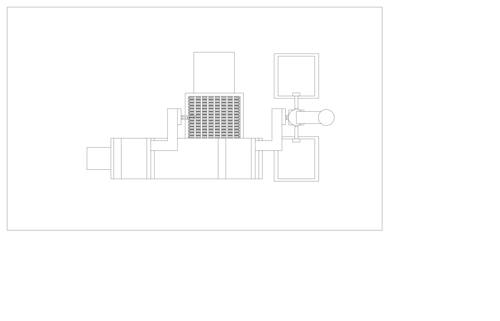
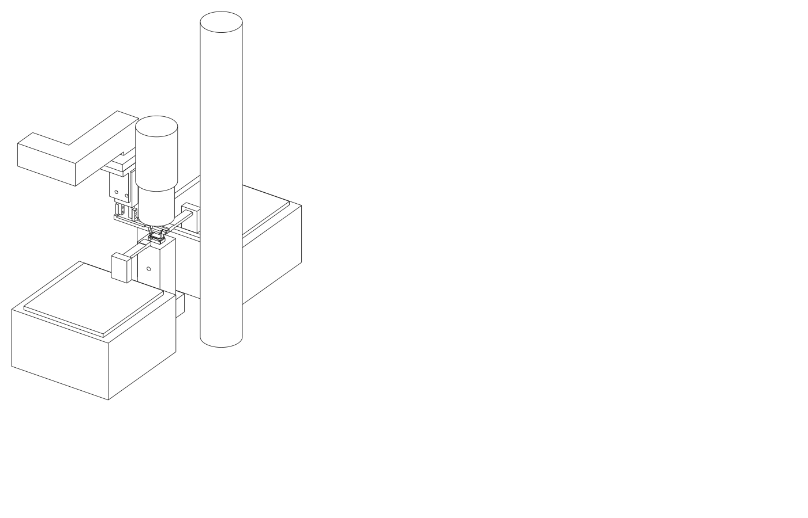

# Gripper module — CAD package

Parametric model: `gripper_module.py` (CadQuery). Run it to regenerate everything in
`out/`. Frame: X = die long axis and gripper stroke, Y = optical axis (fibers along
±Y), Z up with Z = 0 at the die's bottom face when gripped at the nest.

Open `out/gripper_module_assembly.step` in SolidWorks / Onshape / Fusion to review;
send the per-part STEP files to the shop. The assembly includes a dimensionally
faithful stand-in for the SMC MHZ2‑6D (from the SMC catalog drawing), the die, the
nest rails and a translucent 20 mm objective keep-out cylinder.

## What the numbers say (from `out/gripper_checks.txt`)

| Quantity | Value |
|---|---|
| Nose gap with fingers fully closed (hard stop) | 9.870 mm → blade preload 0.130 mm on a 10.000 die |
| Nose gap open | 13.87 mm (2.0 mm per side, MHZ2‑6 stroke) |
| Flexure stiffness | 2.46 N/mm (0.127 mm × 3 mm spring steel, 5 mm free) |
| Grip force | 0.32 N ± 0.06 N over the ±25 µm die-length tolerance |
| Nose top below die top surface | 0.100 mm |
| Tallest tool part inside the objective footprint | near head top, 9.0 mm above die top (far bar 8.0 mm) |
| Actuator body X extent | −40 … −20 mm (objective barrel to X −12, Ø40 tube to X −15) |
| Body Y extent | −2 … 8 mm (fiber clamps at Y ≤ −12 and ≥ 18) |
| Bracket / interface plate X extent | −54 … −22 mm; 25 × 25 pattern centred at X −38, Y 3 |
| Module height, die top to interface plate top | 69.5 mm |

## Parts

| # | File | Material | Qty | Make / buy | Notes |
|---|---|---|---|---|---|
| 1 | — | SMC **MHZ2‑6D‑M9N** | 1 | buy | ø6 parallel gripper, 2 × D‑M9N switches. Fingers 4 × 4 mm, 2 × M2 on each outer face at 2.5 / 7.5 from the tip. Body mounts by 2 × M3 through-threads along Y. |
| 2 | `far_arm_6061.step` | 6061‑T6, hard anodize | 1 | CNC (Protolabs/Xometry) | Rigid arm. Root plate on the far finger's +X face (2 × M2 SHCS, counterbored), transition block, 3 × 3 bar in the Y 4.8–7.8 lane, head with M2 tapped hole for the tip block. |
| 3 | `near_arm_6061.step` | 6061‑T6, hard anodize | 1 | CNC | Compliant arm. Root plate on the near finger's −X face, bar in the Y −1.8–1.2 lane, raised head (top 9.0 above die) with a 0.18 × 3.1 × 3 mm blade slot and an M2 clamp screw. |
| 4 | `far_tip_block_semitron.step` | **Semitron ESd 480** | 1 (+2 spare) | CNC | 3 wide × 2 thick × 8.5 tall. Nose band 0.35 tall protrudes 0.6 toward the die at Z 0.05–0.40. M2 clearance + countersink from the die side. Ø0.6 through hole at Z 0.25 for a thru-beam fiber sensor. |
| 5 | `near_tip_block_semitron.step` | Semitron ESd 480 | 1 (+2 spare) | CNC | 3 × 2 × 1.45 mm, same nose, blade slot 1 mm deep from the top, Ø0.6 sensor hole. Bonded to the blade. |
| 6 | `flexure_blade_0p127_steel.step` | 0.005″ feeler-gauge stock (C1095 spring steel) | 1 (+5 spare) | cut from stock | 3.0 wide × 9.0 long (1 in block, 5 free, 3 clamped). Cut with shears, deburr, degrease. |
| 7 | `bracket_6061.step` | 6061‑T6 | 1 | CNC | L-bracket: 3 mm vertical plate on the body's −Y face (2 × M3 through the body), 6 mm top plate (X −54…−22, kept 7 mm outside a Ø40 microscope tube) with 4 × M4 clearance on 25 × 25 centred at X −38 and 2 × Ø3 dowel holes. Same pattern goes on every carrier. |
| 8 | — | M2 × 6 SHCS ×4, M2 × 5 ×2, M3 × 16 ×2, M4 ×4, Ø3 × 8 dowels ×2, 0.05 mm shim stock | — | McMaster | Stainless. |
| 9 | — | Loctite EA 9460 (or Hysol) for blade-to-block bond | — | — | Cure 24 h; bond line inside the block slot only. |
| 10 | — | Gauge die 10.000 × 6 × 0.500 mm, steel or ceramic | 1 | grind | Sets switch positions and verifies the 0.10 mm top gap. |

## Tolerances that matter (call out on the drawings)

- Nose contact face position relative to the arm's root-plate bolt face: ±0.02 mm on both
  arms (sets the 9.87 gap; shims correct the rest).
- Nose band height 0.35 ± 0.02; nose top at 0.40 ± 0.02 from the block bottom.
- Contact faces parallel to the root-plate face within 0.02 over 3 mm.
- Bar straightness 0.05 over the length; arms must not sag into the die (5 mm nominal
  clearance above the die top).
- Blade slot 0.18 +0.02/−0 wide.

## Assembly and tuning

1. Bolt the bracket to the actuator body (2 × M3 through the body threads), then the
   actuator+bracket to the carrier's 25 × 25 pattern with the two dowels.
2. Bolt the far arm to the far finger and the near arm to the near finger (2 × M2 each,
   0.05 mm shim pack under the far root plate to start).
3. Screw the far tip block to the far head (M2 from the die side).
4. Bond the blade into the near tip block slot; after cure, slide the blade into the near
   head slot and lock the M2 clamp screw. Check the blade hangs plumb.
5. Close the gripper on the **gauge die**. Under the microscope, verify the nose top sits
   0.10 mm below the die surface on both sides and that the nose bands touch the end
   faces over their full 3 mm. Adjust shims under the far root plate until the closed
   gap with no die is 9.87 ± 0.02 (measure with feeler gauges).
6. Grip force: rest the gripper so the near nose presses a 0.001 g pocket scale through a
   10.13 mm spacer; target 30 ± 6 g.
7. Set the two D‑M9N switches at the fully open and fully closed piston positions. Die
   presence is **not** derivable from these switches (the hard stop is the same with or
   without a die); use the camera in Month 1 and the Ø0.6 fiber sensor provision later.

## Open items

- Confirm MHZ2‑6 finger thread depth and that M2 × 6 does not bottom out (SMC drawing
  shows 4 mm fingers; use M2 × 5 if needed).
- The far bar passes over the die's Y = 6 edge at 5 mm height in the Y 4.8–7.8 lane; the
  near bar hangs over the Y = 0 edge. Both are above the fiber axis by 5 mm after a 1 mm
  fiber retract. Confirm against the measured fiber-holder height.
- The objective must clear 9.0 mm above the die top (near head). Measure the working
  distance; if it is below ~11 mm, lower `arm_h` and shorten `blade_free` (stiffer blade
  → thinner stock, 0.004″).
- Bracket is on the −Y face; if the fiber holder on that side needs the room, mirror it
  to +Y (one parameter).

---

# Full station assembly — layout, movement pattern, compatibility

Model: `station_assembly.py` → `out/station_assembly.step`, `out/view_station_*.svg`,
`out/view_nest_closeup_*.svg`, `out/station_checks.txt`. It places the gripper module,
the nest, the transport axes, the two **Thorlabs NanoMax 300** fiber stages with holder
arms, and the **microscope column behind the nest at +X** (where it stands in the bench
photo) on one optical-table plane, and computes clearances. Bought parts are envelopes
(Velmex BiSlide MN10 class 102 × 64 mm bodies, NanoMax 112 × 112 × 62.5 mm).

**Manufacturer models.** `python docs/cad/station_assembly.py --vendor` places real vendor STEP
files from `docs/cad/vendor/` (git-ignored; `vendor/fetch_vendor_step.sh` downloads them) and
writes `out/station_assembly_vendor.step` (106 MB) plus `out/station_checks_vendor.txt`:

| Part | Model | Source | Status |
|---|---|---|---|
| Thorlabs NanoMax 300, MAX313D/M (×2) | 22803-E0W.step | thorlabs.com product assets (direct link in the fetch script) | **placed**; the input stage is rotated −90° so its Z micrometer (46 mm out of the +X face) points −Y and its Y micrometers +X, keeping 9 mm to the X axis. A 180° rotation would put that micrometer 37 mm into the X axis. A left-handed NanoMax would allow the mirror layout. |
| Thorlabs KB1X1 kinematic base | 2374-E0W.step | thorlabs.com | **placed** under the nest riser (25.4 × 25.4 × 12.7 mm assembled) |
| Velmex BiSlide **MN10-0150-M02-21** (X) | `MN10-0150-xxx-21 2Cleats PK266.stp` → `vendor/velmex_MN10-0150-21.step` | velmex.com Technical library (browser captcha, downloaded by hand) | **placed**: body 86.4 × 54.6 mm, slider top 65.1 above the body bottom, 117 mm slider, PK266 motor adds 64 mm beyond the far (−X) end; body's nest end at X −40 (23 mm above the NanoMax base plate), riser 86 mm as **two pedestals** with a gap X −285…−120 where the Y stage and the tray deck pass under the axis (11 / 8 mm clearance at the extreme row) |
| Velmex BiSlide **MN10-0050-M02-21** (Z) | `MN10-0050-xxx-21 PK266.stp` → `vendor/velmex_MN10-0050-21.step` | same | **placed** vertically on the X slider, motor up (tower top Z ≈ 450); slider parked 20 mm above its low limit, adapter plate + 25 mm drop bar to the arm level |
| Velmex BiSlide **MN10-0050-M02-21** (Y) | same file | same | **placed** under the tray, body Y −152…+168, motor toward +Y; slider top is 65.1 above the table so the tray ledges sit 11.9 mm below nest height (the Z drop grows from 3 to 11.9 mm) |
| SMC MHZ2-6D-M9N | series MHZ2 | smcworld.com CAD library (free account required since March 2026) | catalogue-dimensioned envelope |
| Microscope objective / tube / column | — | your microscope's vendor | envelope; measure WD and tube diameter |

Renders of the vendor-model assembly: `out/render_station_vendor_{iso,plan,front,side}.png`
(made with `cadgen step snapshot`, the `cad` skill's renderer).

## Layout (gripper frame: X = die long axis, Y = optical axis, Z up, die bottom at nest = 0)

| Element | Position | Why |
|---|---|---|
| Optical table plane | Z −86 | NanoMax deck 62.5 + platform 4 + holder 20 puts the fiber axis at die-top height (Z 0.5); all risers follow from this. |
| Nest | riser X −8…18, Y −10…16 on a KB1X1-class kinematic base; rail insert Y 0.6…5.4 | Narrow at the top so both fiber corridors stay open. |
| NanoMax 300 (input / output) | inner faces 45 mm from the facets: Y −157…−45 and Y 51…163; X −51…61 | Fiber holders reach in from the platforms; clamps at 12 mm from the facets. |
| Microscope | objective Ø34 centred on the die, front lens at WD 20; Ø40 tube above; arm to a Ø40 column at **X = 80** | Behind the nest, as on the bench. |
| **X axis** (MN10-0150, 381 mm travel; 262 used) | along X, centre-line **Y = −100**, on an **86 mm riser** (two pedestals) so the body sits at Z 0…55, i.e. *above* the NanoMax envelope and above the tray deck that crosses under it; body X −604…−40, motor to X −668 | Beside the input fiber stage, outside the fiber corridor, and above the stage's protruding actuators. |
| **Z axis** (MN10-0050, 127 mm travel; 20 used) | vertical on the X slider; nest position carriage centre X −140 (arm reach 140 mm, so the real slider stays inside its travel at the nest) | Slider end at X −82 vs NanoMax face at X −51 in the other Y band; 77 mm true clearance. |
| **Arm** | 25 mm square L-bar from the Z carriage: +X to X −54, then +Y from the axis band to the die line; end plate over the gripper interface at Z 70–78 | Passes 7 mm outside the Ø40 tube; nothing of it enters the objective footprint. |
| **Gripper module** | actuator body X −40…−20, Y −2…8; bars 5 mm above the die | Only the two 3 mm bars and the tip blocks enter the objective footprint. |
| **Y stage** (105 mm travel) + **wafer tray** | tray of **8 columns × 14 rows = 112 pockets** (one 100 mm wafer), 128 × 106 mm, on the Y-stage deck; columns at die X **−150 … −262** (16 mm pitch), rows at 7.5 mm pitch; X selects the column, Y the row | Dies return to their own pocket after test (results live in the map); 11 mm from the X axis band; the gripper never crosses the fiber line. |

## Movement pattern (one exchange)

Coordinates are X-carriage centre / Z-carriage height of the arm end plate / Y-stage
pocket position. Fibers are only ever moved by their own NanoMax stages.

| Step | Axis | From → to | Interlock |
|---|---|---|---|
| 1 | NanoMax Y (both) | fibers retract 1.0 mm along ±Y | fibers-retracted flag set |
| 2 | Z | +8 mm (arm end plate Z 70 → 78), gripper open | fibers retracted, objective gap ≥ 11 mm |
| 3 | Z | −8 mm: noses descend beside the die's end faces | — |
| 4 | gripper | close (finger-on-finger stop; 0.32 N on the die) | — |
| 5 | nest | rail vacuum off; **Z +8 mm** lifts the die | vacuum switch reads atmosphere |
| 6 | X | −120 → −270 … **−382** (column *c* of the tray: 150 + 16·c mm along the die's long axis, front of the bench) | Z at +8 |
| 7 | Y stage | brings row *r* to Y = 3 (±48.75 mm) | can pre-position during step 6 |
| 8 | Z | −8 −3 mm: die onto the pocket ledges (3 mm below nest height) | — |
| 9 | gripper | open (+1.5 mm per side) | — |
| 10 | Z | +11 mm; then steps 6–9 in reverse with the next die; at the nest: rails vacuum on, jaws open, Z +8, camera pose, correction, fibers approach | seat detection by rail vacuum |

Exchange time budget: ~20 s with lead-screw stages at 20 mm/s; the X move dominates.

**Pocket geometry.** Cavity 12.0 × 6.8 mm: the die is retained to ±1.0 mm in X by its four corners against the end walls and ±0.4 mm in Y, inside the jaws' ±1.9 mm capture. Each end wall carries a 3.6 mm wide nose slot (Y 1.2–4.8) reaching 2.2 mm beyond the wall so the open jaw noses (0.8 mm wide, 1.9 mm outside the die) descend freely. Ledges 1.0 mm wide under the facet-edge strips, 0.8 mm tall.

**Container assumption.** One 4″ wafer (~100–112 dies of 10 × 6 mm, all in one orientation) = one tray. Pocket
indices mirror the wafer map (row, column), so a die's identity is its pocket. The tray
(128 × 106 × 6 mm, SLA-printed, lidded, DataMatrix on the rim) fits a Form 3 bed and a
5″ wafer box. Physical pass/fail binning is not done at the tester; it is a map
operation at the sorting station if ever needed. A second tray position along X would
need +130 mm X travel and is the Month-2 option if two wafers must be resident.

## Compatibility results (from `station_checks.txt`)

- **Microscope:** finger bars 12.0 mm below the objective front lens (WD 20); near head
  11.0 mm; actuator body 8 mm outside the barrel and 5 mm outside a Ø40 tube; arm end
  plate and bracket 7 mm outside the tube; nothing within 44 mm of the column. If the
  tube above the objective is wider than Ø40 (nosepiece, turret), move the actuator
  further out with `body_cx`; the arms lengthen by the same amount.
- **Fiber stages and holders:** gripper bars 10.2 mm from each holder arm (in Y);
  actuator body 20.7 mm from both holders; X axis 9 mm from the input NanoMax body in X
  and above its actuator zone; X carriage 73 mm from it; Z tower 84 mm from the holder.
  The die's travel path (after the 8 mm lift) clears both holders by 3.6 mm and both
  fibers by 7.5 mm, and never crosses the fiber line.
- **Tray side:** Z tower at the farthest column 86 mm from the Y-stage body; the pocket
  walls 4.7 mm under both bars at the placing height; X travel used 262 of 300 mm.

## Open dimensions to measure before ordering the axes and risers

1. Fiber axis height above the NanoMax platform (`holder_axis_above_deck`, assumed 20):
   sets every riser height.
2. Objective working distance and the diameter of whatever sits above it (`obj_wd`,
   `tube_dia`).
3. NanoMax actuator protrusions and which faces they are on (the raised X axis assumes
   they stay below Z −10).
4. Vendor carriage bolt patterns (Velmex / Zaber / Thorlabs) for the riser, tower bracket
   and arm end plate.
