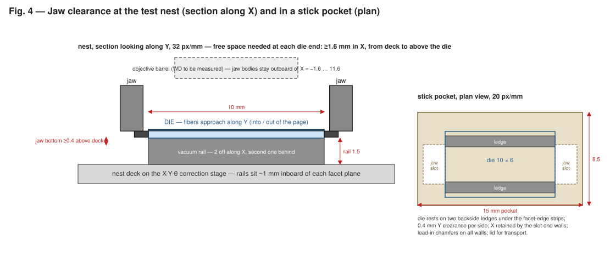
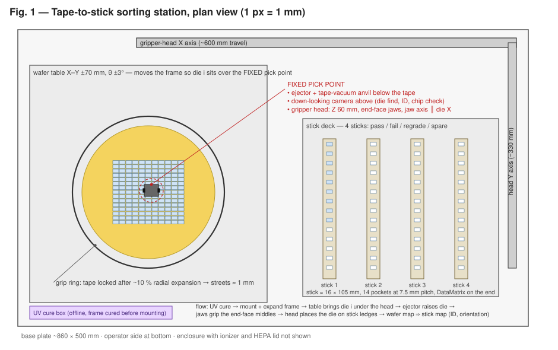
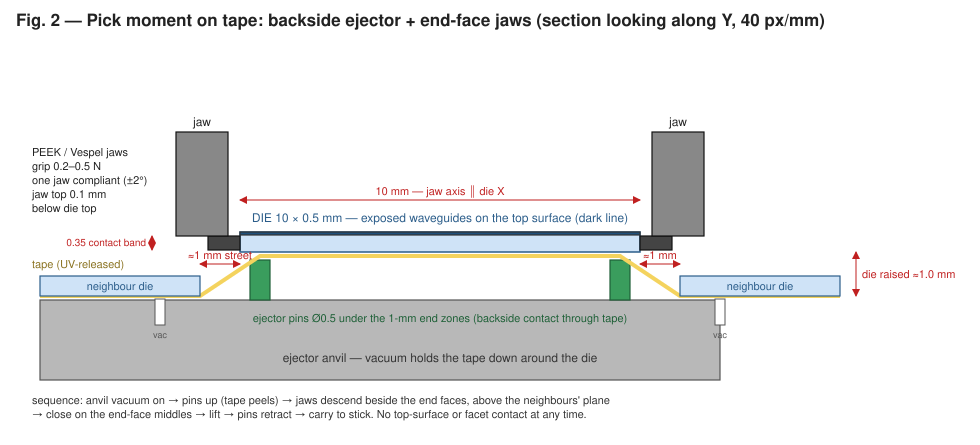
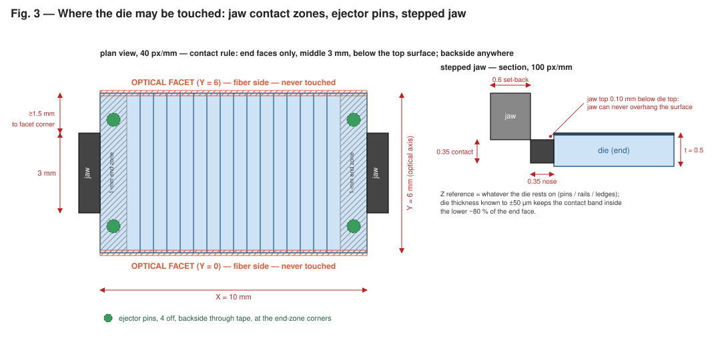
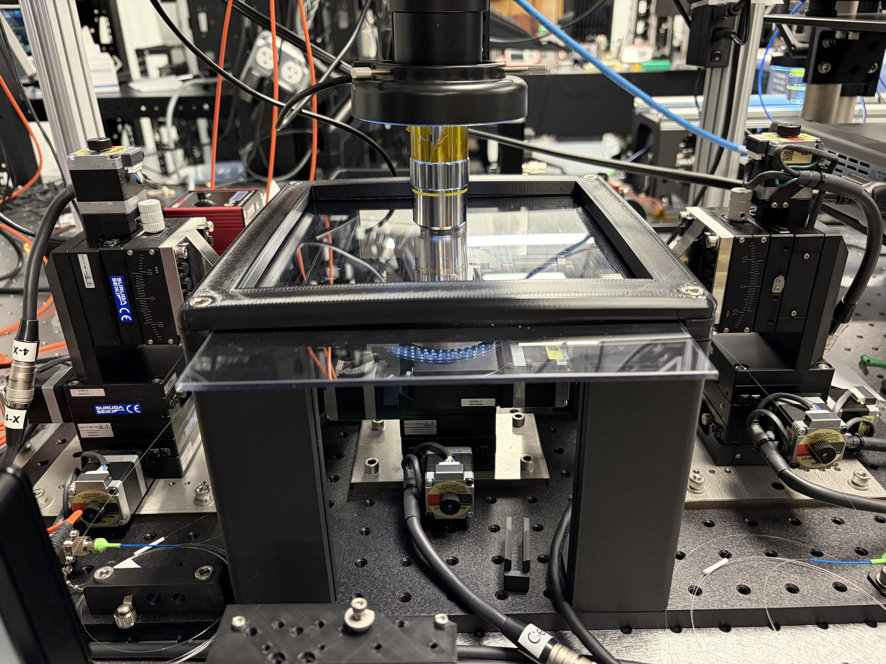

# System Redesign Study — Batch Edge-Coupled Testing of Hundreds of 10 × 6 mm Photonic Dies

**Status:** concept study for review, rev. 2.11 (CAD of the gripper, the self-registering nest on its die stage, the wafer tray and the full station with its MISUMI LX20 transport in [`cad/`](../cad/README.md))
**Scope:** ground-up redesign of the die-tester stage and handling system. The current
machine is architected around a single manually loaded die; this study treats the whole
stage system as open for redesign and asks what a machine looks like when the unit of
work is a **batch of hundreds of dies** and the target operating mode is **unattended
(lights-out) runs**, with operator involvement reduced to loading/unloading bulk
carriers and reviewing results.

Rev. 2 changes versus rev. 1: the study is reframed from "retrofit the existing
single-die stages" to a full system redesign; the carousel concept is removed; the
scaled concepts are re-derived for hundreds-of-dies batches; a recommended system
architecture is described at subsystem level. Rev. 2.1 adds the as-built observations
from the current bench (Appendix A, photo in `docs/images/current_setup.jpg`) and folds
their consequences — overhead microscope clearance, die-exchange approach direction,
fiber-arm envelope, enclosure and fiber management — into §3 and §6. Rev. 2.2 records
that the dies have **no top cladding** (exposed ridge waveguides): the nest becomes
backside-only with vision registration (§3), and §6a selects the pick-and-place system
(SCARA + backside vacuum tongue) and the slotted storage stick that goes with it.
Rev. 2.3 adds §6b: dies arrive diced on tape with kerf-width streets, so a separate
tape-to-stick sorting step (UV release, tape expansion, backside ejector, end-face edge
gripper) is defined, and the edge gripper is recorded as a candidate tester tool.
Rev. 2.4 decides on **one end-face edge gripper for every handling step**, demotes the
backside tongue to a documented fallback, and adds the sketches: sorting-station layout,
ejector/jaw pick section, contact zones with stepped-jaw detail, and nest/stick jaw
clearance (`docs/images/fig1…fig4`). Rev. 2.5 replaces the SCARA with a bench-level
3-axis Cartesian for the tester: the gripper must enter a straight ~13 mm corridor under
the objective, a SCARA's vertical quill lands where the objective barrel is, and the
articulated desktop arm first proposed for prototyping approaches from above and behind.
Rev. 2.6 sizes the storage carrier as one **wafer tray** per 4″ wafer (8 × 14 pockets; the die
returns to its own pocket) and moves the design into CAD (`cad/`). Rev. 2.7 aligns the
storage-carrier text with the tray, and records that the gripper and the complete station
(nest, NanoMax fiber stages, microscope, Cartesian axes, tray) are modelled and
clearance-checked there; the interactive model follows the same layout. Rev. 2.8 replaces
the rail nest with the self-registering, temperature-controlled **chuck-and-cage nest**
(§3) and drops the X-Y-θ correction stage. Rev. 2.9 restructures the CAD into one folder
per component (`cad/gripper`, `cad/nest`, `cad/tray`, `cad/station`, shared `cad/common`)
with a single build script that keeps them synchronized, and brings §3 and the interactive
model up to the chuck nest. Rev. 2.10 puts the nest on a **die stage**: the devices span ~8 mm
along the die and the NanoMax fiber stages travel only 4 mm, so a Suruga KXC04015-C X stage under
the nest steps the die from device to device (as the current tester's centre stage does), with a
MISUMI RMPG40W-N motorized rotary on top of it that nulls the yaw measured fiducial-to-fiducial
under the microscope; the gripper meets the nest at stage home only. The stack needs 100 mm under the die, so the
fiber stages sit on 25 mm risers. Rev. 2.11 writes down what the transfer axes actually need
(±0.15 mm at the nest, ±0.3 mm at the tray, ±0.05 mm in Z, since the die is placed by hard
references) and replaces the Velmex BiSlides with three **MISUMI LX20** actuators (lead 5 for
speed); the tray moves 55 mm closer to the nest and the X actuator's narrow band beside the tray
sweep removes the bridge riser. The interactive model still shows the rev. 2.10 layout.

Coordinate convention follows the brief: **X** = 10 mm die dimension, **Y** = 6 mm die
dimension (optical propagation; fibers approach along ±Y), **Z** = vertical, **θ** =
in-plane rotation.

---

## 1. Design intent: what "scaling to hundreds" actually changes

The single-die machine optimizes one coupling event. A batch machine optimizes a
*campaign*. That flips three assumptions baked into the current stage architecture:

1. **The bottleneck metric changes.** Per-die test time is
   `T_die = T_exchange + T_acquire + T_measure`. On this tester, `T_measure` for a full
   die (e.g. devices 2–66 in the current `run_all_waveguides` campaigns) is tens of
   minutes to hours; `T_exchange` is minutes. So shaving exchange seconds is not the
   prize. The prize is **removing the human from the loop between dies**, so the
   machine runs nights and weekends: a queue of 100+ dies with automatic exchange
   raises utilization from ~30 % (attended hours) toward ~90 %. For short screening
   tests (a few devices per die, `T_measure` ≈ 2–5 min), exchange and first-light time
   *do* dominate, so the design must also make exchange fast and acquisition
   deterministic. The architecture below serves both regimes.
2. **Precision should exist at exactly one point.** A carrier that replicates precision
   nests N times pays for precision N times and verifies it N times, and N is capped by
   stage travel. At hundreds scale, the winning pattern is the one used by every
   production die/wafer prober: **bulk storage is dumb and dense, transfer is coarse,
   and precision exists only at the single test site**, where one precision nest
   is made once, characterized once, and reused for every die forever.
3. **Unloading is as important as loading.** At hundreds of dies, "take the carrier off
   and sort the dies by hand" reintroduces the labor the system was meant to remove.
   The redesign must include **automatic binning** (pass/fail/grade back into output
   carriers) and per-die traceability (die ID ↔ results database).

Requirements R1–R8 from the brief (facet access, coarse-in/precise-out loading, common
optical line, independent registration, permitted contact zones, chip safety,
deterministic carrier interfaces, system-level throughput) all carry over unchanged and
are not repeated here. The presentation budget also carries over: the fixture chain
must deliver each die within roughly **±10–25 µm in Y/Z and ±0.05° in θ** of nominal at
the test site, so first light is a verification, not a search.

---

## 2. Functional architecture of the redesigned machine

Four decoupled subsystems, following the brief's storage / transfer / presentation
split, plus the optical engines:

```
   BULK STORAGE            TRANSFER              PRECISION            OPTICAL
   (hundreds)              (coarse)              PRESENTATION         ENGINES
┌────────────────┐    ┌────────────────┐    ┌────────────────────┐   ┌──────────────┐
│ input carriers │ →  │ robot / feeder │ →  │  ONE test nest at  │ ← │ 2× fiber     │
│ output bins    │ ←  │  ±0.3 mm class │ ←  │  the optical site  │   │ aligners +   │
│ (hotel/elev.)  │    │                │    │  (vision-regis-    │   │ vision       │
└────────────────┘    └────────────────┘    │  tered, §3)        │   └──────────────┘
                                            └────────────────────┘
```

- **Bulk storage** holds dies in dense carriers (slotted sticks / pallet cassettes, per
  concept) in an input **hotel** (stacked shelves with an
  elevator or a flat deck), plus output positions for binning. Capacity target:
  ≥ 200 dies resident.
- **Transfer** places the selected die into the test nest and returns it after test.
  It needs only ~±0.3 mm, ±1° placement accuracy — vision registration at the nest closes
  the rest. This is deliberately a cheap, robust motion system, not a precision stage.
- **Precision presentation** is one nest (§3) that registers X and yaw mechanically
  (push-to-stop), leaves Y to vision and the fiber stages, and steps the die along X from
  device to device on a short-travel stage under it (rev. 2.10).
  No long-travel precision axis exists anywhere in the machine: the die never travels
  far while registered, and nothing precise ever moves far.
- **Optical engines**: the two fiber aligners (each XYZ + fine alignment) and machine
  vision. Because the die always appears at the *same* nest within tens of µm, the
  fiber stages work around one fixed nominal point for the entire life of the machine —
  which is also what makes fast piezo-assisted alignment and pre-computed approach
  trajectories practical.

The reference hierarchy collapses to its shortest possible form:
`machine base → nest datums → die → waveguide` — no removable precision carrier in the
chain at all in the primary concept.

---

## 3. The precision test nest (single copy, heart of the machine)

**Governing constraint (rev. 2.2):** the dies carry **air-clad ridge waveguides — no
top oxide**. The top surface is untouchable everywhere, and the facet edges, where the
exposed waveguides terminate, are the most fragile lines on the part. The nest and
every handling step therefore contact the die only on its **backside** (rails, ledges,
ejector pins) and, for transfer, on the **middle of its two non-optical X-end faces**
(gripper jaws, §6a, Fig. 3). In-plane registration at the nest is done by **vision**,
not by side datums: with a single fixed nest and a calibrated overhead camera, a
measured X/Y/θ is as good as a mechanical one and carries zero facet risk. This
supersedes the brief's facet-face datum sketch (§9 of the brief).

*Rev. 2.8/2.9 (CAD of record: [`cad/nest`](../cad/nest/README.md)): X and yaw are now registered
mechanically after all — not on the facets but on the **non-optical +X end face**, by two
hard-stop pads the gripper pushes the die against with its own 0.25 N compliant nose (the
same end-face band the jaws use). Y stays free, read by the camera and absorbed by the fiber
stages, and is caged to ±0.6 mm by corner guards that stand outside the facet planes only
where no fiber ever goes. The X-Y-θ correction stage is dropped; the nest sits on the
kinematic base. The two vacuum rails of rev. 2.2–2.7 are superseded by a lapped **copper
vacuum chuck pad** with a TEC under it. The rails still appear in Fig. 4 and in the older
figures; the geometry of record is the CAD.*

One nest, machined and lapped once, characterized exhaustively (chuck-and-cage, rev. 2.9):

```
 Top view (die transparent)                                Side view (looking along X)

   Y=8   ┌────────────────────────────────┐ cage plate    fiber →                  ← fiber
         │ ▪ Y guard            Y guard ▪ │ (Semitron)      ┃    die 0.5 thick        ┃
   Y=6 ──│───────────── facet ────────────│──        holder ┸┌──────────────────────┐┸ holder
         │▪┃   ┌────────────────────┐   ┃▪│ ← stop pad  Y −5 │  DIE                 │ Y +11
         │ ┃   │  · · ·  chuck pad  │   ┃ │   (Y 4.8–5.4) ───┴─┬──────────────────┬─┴───  cage plate
         │X┃   │  9 × 5 mm, lapped  │   ┃ │                    │ copper pad 9 × 5 │       Z −1.5
         │ ┃   │  · · ·  6 vac holes│   ┃ │ ← stop pad         │   plenum, holes  │
   Y=0 ──│▪┃───│──────── facet ─────│───┃▪│── (Y 0.6–1.2)      │  copper neck     │  10 mm wide
         │ ▪ Y guard            Y guard ▪ │                    │  (riser neck)    │  down to Z −12
   Y=−2  └────────────────────────────────┘                 ═══╧══════════════════╧═══ TEC 15 × 15
         X=−0.4  X=0             X=10  X=10.6              wide riser / heat sink below the holders
         X guard                   +X stop pads
```

- **Support and hold-down (Z, pitch, roll — mechanical):** a lapped (≤ 3 µm) **copper
  chuck pad** 9 × 5 mm, 0.5 mm inboard of every die edge, so 75 % of the backside rests on
  metal; six Ø0.5 vacuum holes into a plenum in the copper block. The pad defines the die
  plane to microns — exactly the degrees of freedom vision measures poorly. The pad top is
  0.5 mm below the waveguide plane; the cage plate around it is 1.5 mm lower still and
  never in a fiber's path. Vacuum level doubles as **presence/seat sensing**.
- **Thermal:** the chuck is the top of a Ni-plated C101 copper block whose neck passes
  through the cage plate and the riser (0.3 mm air gap) to a **15 × 15 × 2.5 mm TEC** at
  Z −12; the aluminium T-riser is the hot-side sink. A thermistor bore enters from +X. The
  die can be temperature-controlled at the nest without any part touching its top or facets.
- **Fiber access:** the fiber tips protrude only ~5 mm from their holders (25 mm wide,
  Z −8…+4 around the fiber axis), so the holder bodies come to Y −5 and Y +11. The nest is a
  **10 mm wide neck** (Y −2…8) from the cage plate down to Z −12, below the holders'
  underside, and widens only there. Nothing stands where a fiber can go (X 1…9 in front of
  either facet).


- **Jaw clearance at the die ends (Fig. 4):** the transfer tool grips the die by its
  two non-optical X-end faces (§6a), so the nest leaves the ends free except for the
  0.6 mm stop pads and the 0.4 mm-gap X guard, all below Z 0.40; the jaw noses descend
  outside them (checked closed / open / during the push in `cad/nest/checks.txt`).
- **In-plane registration — X and yaw mechanical, Y by vision:** two **Semitron ESd 480
  stop pads** on the +X end face (Y 0.6–1.2 and 4.8–5.4, 0.6 mm in from the facets, contact
  band Z 0.05–0.30, yaw from a 4.2 mm base ≈ 0.03°). The gripper sets the die down 0.2 mm
  short of the pads, opens, and indexes +1.7 mm: its open compliant nose slides the die onto
  the pads and overtravels 0.1 mm, so the flexure limits the push to **0.25 N**
  (**push-to-stop**). Milling cannot make a sharp inside corner and the die's corners are
  not trusted either, so the die registers on two pads and a plane, never in a corner: the
  pads sit 0.6 mm from the facets with a 0.2 mm relief to the guards. Y is free, read by the
  overhead camera (the existing OpenCV template/edge methods in `ChipAlignmentController`)
  and absorbed by the fiber stages' own Y travel; four **corner guards** 0.6 mm outside the
  facet planes at the die corners only (X ≤ 0.5 and X ≥ 9.5) and an X guard 0.4 mm behind
  the −X end face cage the die so it cannot leave the pad, and touch nothing in normal
  operation. The facet faces are never a datum surface.
- **Die stage (rev. 2.10):** the nest sits on a Suruga KXC04015-C X stage (15 mm travel,
  1 µm half step, on the existing DS102) that steps the die ±4 mm so every device comes under
  the fibers, which then realign per device; one X move keeps both fibers registered to each
  other, exactly as the current tester works. On top of it a MISUMI RMPG40W-N motorized worm-gear
  rotary (on the DS102 axis the current centre stage's θ uses) turns the die relative to the
  travel: after loading, the X stage brings the fiducial at one die end and then the other under
  the microscope, the camera reads the lateral offset, and the rotary nulls it. That offset is the
  die's yaw relative to the travel (the travel's own angle cancels), which is why the rotary has to
  sit above the X stage, not below it. Per-device realignment needs only ~0.1° of yaw; open-loop
  stepping needs ~0.02°, which the motorized trim makes possible. The gripper meets the nest at the stage's home position only, enforced by the
  fence. The stack needs 100 mm under the die, so both fiber stages and the Y stage sit on 25 mm
  riser plates. Stack and clearances: [`cad/nest`](../cad/nest/README.md).
- **Exchange sequence per die:** die stage to home → fibers retract (interlocked) → jaws
  descend beside the outgoing die's end faces, close, chuck vacuum off, lift → carry to its
  tray pocket → return with the incoming die → lower onto the chuck 0.2 mm short of the pads,
  jaws open, push-to-stop, chuck vacuum on, jaws retract and rise → camera confirms X against
  the pads and reads Y → fibers approach → die stage steps device by device.
- **No structure above the die top surface** in the central 8 mm of X, no structure at
  waveguide height anywhere in the ±Y fiber approach cones, and a software/hardware
  interlocked fiber-retract corridor before any nest actuation (carries over R1/R5/R6
  and brief §15/§22 unchanged).
- **Envelope as it exists today (Appendix A):** the fibers arrive on long, thin
  cantilevered holder arms that pass through slots in the ±Y walls of the present
  enclosure, and the die sits under a high-magnification objective a short working
  distance above it. Three consequences for the nest: (i) the ±Y corridors must be
  sized for the *arm*, not the fiber — the current arms are tens of mm long with a
  V-groove clamp near the tip, so the pedestal recess and any nest wall on the ±Y sides
  are set by clamp height/width, not by the 125 µm fiber; (ii) the only free approach
  directions to the die are **±X** (horizontally, under the objective) and **from
  above** (only if the objective retracts), which fixes the die-exchange geometry in §6;
  (iii) the nest must be low and stiff — the present chuck rides a tall stage tower,
  and a low pedestal directly on the base both shortens the structural loop to the
  fiber stages and frees vertical room for the exchange mechanism.

Everything else in the machine can be ordinary industrial automation because this one
component absorbs the precision problem.

---

## 4. System concepts at hundreds-of-dies scale

Three full-system concepts plus one deliberate inversion. All share the §3 nest; they
differ in storage format and transfer mechanism — which is exactly where the brief says
the freedom is.

### S1 — Stick hotel + Cartesian pick-and-place into the fixed nest  *(recommended)*

**Storage:** dies sit in **slotted carrier sticks** (§6a) whose pockets support the die
on its backside only and leave a channel under the center open at both ends. A hotel
deck holds 6–10 sticks (input, pass, fail, regrade) — ≥ 100–200 dies resident. Sticks
are loaded at a bench, ideally by the dicing vendor.

**Transfer:** a bench-level **3-axis Cartesian** (motorized linear stages, µm class)
carrying a stepped-jaw **end-face edge gripper** (§6a, Fig. 3) on a low arm that takes the
die by the middle of its two non-optical X-end faces, lifts it off the pocket ledges or
nest rails, and carries it. No top-surface or facet contact at any point. Placement
scatter of a few tenths of a mm in Y is closed by vision registration at the nest; X
and θ are already defined by the jaw faces.

**Sequence per die:** fibers retract → gripper removes die *i* from the nest → returns
it to its tray pocket → picks die *i+1* → sets it on the nest chuck → jaws open, push-to-stop
onto the +X pads, chuck vacuum on → overhead camera confirms X and reads Y → fibers
approach along the pre-computed trajectory → first light as verification → measure. In
the screening regime a second gripper pre-stages die *i+1* so the swap itself is ~5 s.

**Why it wins at this scale:**
- Operator interaction = swap packs and press start: **one interaction per ~100–200
  dies**, and runs continue unattended overnight.
- Automatic binning and per-die traceability (pack + pocket ID ↔ results) fall out of
  the architecture for free.
- Exactly one precision component; adding capacity = adding shelf positions, which are
  free.
- Failure containment: a mis-seated die is detected by vacuum/vision *before* fibers
  approach; the die is returned to a reject position and the run continues — no human
  needed for the common faults.

**Main risks:** it is a real machine build (robot, hotel, gripper tooling, guarding,
ESD/ionization, error-recovery software); every die is robot-handled twice — mitigated
by backside-and-end-face-only contact, low approach velocities, and the fact that robot handling
replaces *tweezers*, historically the worst offender; custom sticks must be adopted
upstream; total cost dominated by the robot cell (order €30–60 k in COTS hardware
before integration labor).

### S2 — Pallet cassette line (SMT-feeder pattern)

**Storage:** each die is mounted **once**, at an offline bench station with its own
self-registering fixture, onto a reusable ~16 × 16 mm hardened **pallet** carrying
ground datum features and a clip/latching hold. Pallets stack ~25–50 high in gravity
**cassettes**; several cassettes = hundreds of dies queued.

**Transfer:** a simple elevator + pusher (walking-beam class mechanics, no robot)
advances one pallet at a time into a **kinematic dock** at the optical site: 3-groove
mount + clamp, ~1–2 µm repeatable. Tested pallets are pushed on into output cassettes
(binning by gate = two output cassettes minimum).

**Strengths:** bare-die handling happens exactly once per die, at a bench with ideal
ergonomics and lighting — the lowest facet-risk concept; the tester-side automation
handles only robust identical steel objects, so it is *simpler and more reliable* than
a bare-die robot; pallet serial numbers give bulletproof traceability; scaling is
linear (more cassettes).

**Weaknesses:** the per-die pallet-mounting labor is real (~30–60 s/die at the bench) —
it relocates rather than removes the per-die human touch, unless a second loading
automat is built later; a pallet fleet of 300+ units is a recurring cost (tens of € per
pallet at quantity) and a management task (cleaning, inspection); one extra tolerance
interface (die→pallet→dock) versus S1's die→nest.

**Best fit:** if §8 measurements or early trials show that *any* robot handling of bare
dies is unacceptable for facet yield, S2 is the scaled architecture of choice.

### S3 — Batch comb plates on a long-travel transport  *(semi-automated fallback)*

The linear self-registering magazine of the brief, scaled as far as it goes: a
**300–400 mm travel transport axis** carrying 2–4 removable monolithic comb plates of
12–15 nests each (~25–60 dies per load), each comb kinematically mounted, loaded
offline at a bench station, both ±Y corridors open along the full row.

This is the least machine-building of the three: no robot, no feeder, ~1/5 the
integration effort of S1. But it fundamentally cannot reach the campaign goal alone:
precision is replicated ~50× instead of 1×; capacity is capped by transport travel;
there is no automatic binning; and an operator event is still needed every ~50 dies, so
overnight runs end when the combs do. **Role in the redesign:** the engineering-lot /
bring-up mode and the risk-reduction stepping stone — the nest design, vision verify,
fiber choreography, and orchestration software developed for S3 transfer 1:1 to S1
(same nest, same software, the robot simply replaces the transport axis). Not the end
state.

### S4 — Stationary die field + translating optical head  *(evaluated, not selected)*

The inversion the brief asks about, evaluated clean-sheet rather than against legacy
software: dies rest in large fixed comb fields; both fiber aligners + cameras ride a
long gantry. Even with a from-scratch design this loses on physics, not on software
legacy: the moving payload is two opposed fiber stacks whose *mutual* alignment must
survive translation (the hardest stiffness/metrology problem available), optical fibers
and cabling live in drag chains (polarization and loss instability injected directly
into the measurand), and the precision problem is replicated across every nest in the
field *and* the gantry. It becomes attractive only if dies must sit on infrastructure
that cannot move (temperature-controlled chuck, RF probe cards on every die). Recorded
with that trigger condition; otherwise rejected.

---

## 5. Comparison at hundreds-of-dies scale

Ratings: ● strong / ◐ adequate / ○ weak.

| Criterion | S1 hotel + Cartesian + 1 nest | S2 pallet cassette line | S3 batch combs | S4 moving head |
|---|---|---|---|---|
| Dies resident per operator interaction | 100–200 ● | 100–400 (cassettes) ● | 25–60 ◐ | 25–60 ◐ |
| Operator minutes per 100 dies | ~5 (stick swaps) ● | ~60–100 (pallet mounting) ○ | ~30 (comb loading) ◐ | ~30 ◐ |
| Unattended (lights-out) capability | full ● | full ● | until combs exhausted ◐ | until field exhausted ◐ |
| Number of precision feature sets | 1 ● | 1 dock + pallet fleet ◐ | ~50 nests ○ | ~200 nests + gantry ○ |
| Die-to-die Y/θ consistency | best possible (one nest) ● | dock-limited ● | comb machining ◐ | comb + gantry metrology ○ |
| Automatic binning / traceability | native ● | native (2+ cassettes, serials) ● | none ○ | none ○ |
| Bare-die handling events per die | 2 robot touches ◐ | 1 bench mount ● | 1 bench load ● | 1 bench load ● |
| Facet-risk profile | robot near facets, gated ◐ | lowest ● | low ● | fibers translating over dies ○ |
| Exchange time (short-test regime) | ~15–25 s, pipelined ● | ~10–20 s ● | ~10–20 s ● | ~20–40 s ◐ |
| Error containment / recovery | auto-reject, run continues ● | auto-gate ● | skip nest, human sorts later ◐ | ○ |
| Mechanism reliability class | robot cell ◐ | pusher/elevator, simplest ● | single axis, simplest ● | long gantry + drag chains ○ |
| Integration effort / relative cost | ~5× (baseline = S3) ○ | ~3× ◐ | 1× ● | ~8× ○ |
| Incremental path from S3 | direct (same nest, same s/w) ● | dock ≠ nest, partial ◐ | — | none ○ |
| Scalability beyond hundreds | add shelves ● | add cassettes ● | capped by travel ○ | capped by field ○ |

---

## 6. Recommended system: S1, reached through S3's nest

**End state (the machine to design toward):**

- **Base:** granite or polymer-granite machine base; thermal enclosure; ionized-air ESD
  environment; light curtain / interlocked doors around the robot volume.
- **Optical site:** the §3 chuck-and-cage nest on its kinematic base, fixed near the
  center of the base. Overhead verify camera (die pose, existing OpenCV template/edge
  methods carry over); optional side cameras on the fiber aligners for gap/facet view.
- **Fiber aligners (redesigned, both sides):** stacked coarse XYZ (the DS102-class
  stepper stacks are adequate here and can be retained *as components*) + **piezo
  flexure XYZ fine stages** (~100 µm range, nm resolution) for fast raster/gradient
  alignment. With the die always at the same nominal point, approach trajectories are
  pre-computed and first light typically completes in seconds. Fibers park in a
  retracted, interlocked position during every nest/robot action.
- **Vision column (redesigned around the exchange):** the overhead objective stays —
  it is the verify camera — but it must **clear the exchange volume**. Two options,
  chosen by the objective's working distance and the end-effector height: (a) put the
  microscope column on a motorized Z lift (or a pneumatic two-position retract) that
  raises it 50–100 mm during every exchange; (b) keep it fixed and use a *long*
  working-distance objective (≥ 30 mm) with a low-profile end-effector that enters
  horizontally along ±X beneath it. Option (b) removes a moving element from the
  optical path and is preferred if the magnification budget allows; (a) is the
  fallback; (c) since the present column can be **rotated away by hand**, motorize that
  pivot (a stepper or pneumatic rotary with a hard stop) and swing the objective clear
  for every exchange. With the gripper module of §6a the only tool parts under the
  objective are two thin finger bars, ~3 mm tall at 5 mm above the die top, so option
  (b) needs a working distance of only ~11 mm and is the baseline; option (c) is the
  fallback for short-WD objectives and is harmless to vision registration **provided
  the die pose is measured relative to nest fiducials in the same image**, which makes
  the pivot's return repeatability irrelevant. It costs ~2–5 s per exchange and one
  more interlocked mechanism. In every case the objective-to-die gap (or the
  swung-clear state) is a hard interlock input for the transfer axes, exactly like
  fiber retract.
- **Transfer:** a bench-level **3-axis Cartesian** beside the optical table, carrying the
  stepped-jaw **end-face edge gripper** on a low horizontal arm that enters under the
  objective along X — the only direction not occupied by fiber arms (±Y) — descends
  beside the die's end faces, grips their middles and lifts the die off its rails. Selection rationale, tool geometry and alternatives
  are in §6a. The fiber arms park retracted and the objective gap is confirmed before
  the jaws may descend; all states are interlocked.
- **Storage:** custom **carrier sticks** (§6a, Fig. 4) whose pockets present the same
  backside ledges and end-face jaw slots as the nest, so the gripper picks from storage
  and places into the nest with one motion primitive. 6–10 sticks on a hotel
  deck with stick-ID reading (DataMatrix); designated output sticks for binning.
  Located to one side of the optical site along **X**, so the robot's transit path
  never crosses the fiber corridors. Standard waffle packs are not used on the machine
  (closed pocket floors force a top pick).
- **Enclosure and dressing (replaces the present small box):** the current 3D-printed
  enclosure with glass top and acrylic front shows the need for still air and dust
  control already exists; in the redesign it grows into the full cell — one enclosure
  around nest, fiber aligners, robot and hotel, with a laminar top-down flow or at
  least a still-air lid, interlocked doors, ionized air, and windows placed for the
  overhead camera and operator view. Fiber pigtails and stage cables, which today lie
  loose on the breadboard, are routed in captive guides with strain relief on the
  aligner frames: a robot may never share a volume with an unmanaged fiber. Fiber
  aligners mount to the same rigid base plate as the nest rather than to the optical
  table individually, closing the metrology loop through one stiff part.
- **Software (this repo evolves into the orchestrator):** a campaign layer above the
  existing per-die stack — die queue + results database keyed by pack/pocket ID; state
  machine per die (stored → picked → verified → nested → measured → binned) with
  explicit recovery transitions; the existing `FirstLightController` /
  `WaveguideAlignmentController` become the "measure" state's engine; `SoftwareFence`
  logic generalizes into the fiber/robot interlock. The current codebase's
  per-waveguide automation is the one part of the present system that transfers to the
  redesign essentially intact.

### 6a. Pick-and-place system and die pickup

**How a die is picked up — one tool everywhere (rev. 2.4): the end-face edge gripper.**
The gripper is a **self-contained module** — actuator, flexure fingers, position
switches, valve — with a plain bolt-and-air interface (one plate, four screws, one air
pair, one sensor cable). The same module bolts to the Cartesian Z-arm at the tester,
to the sorting-station head, and, if ever needed, to a fallback robot's flange through
an adapter plate. It is engineered once, separately from whatever carries it, because
it is the only part every handling step shares. Its actuator body sits **outboard at
X ≤ −16 mm**, outside the objective footprint; only two thin cantilever finger bars
(~3 mm tall, ~5 mm above the die top) and the noses ever enter the space under the
objective (3-D model, nest scene).
Because the top surface carries exposed waveguides and the facet edges are fragile, the
die is gripped only by the **middle 3 mm of its two non-optical X-end faces**, and is
otherwise supported only on its backside (ejector pins, nest rails, stick ledges). The
same gripper picks from tape at the sorting station (§6b), exchanges dies at the nest,
and bins them into sticks. Geometry in Figs. 2–4:

- **Jaws:** parallel micro-gripper (pneumatic or voice-coil, with jaw-position feedback
  for die-present / no-die detection), PEEK or Vespel jaw inserts, dissipative grade —
  LN is pyroelectric and charges with every temperature swing; the cell is ionized.
  One jaw is compliant in yaw (±2°) so both faces seat on a die whose end faces are not
  perfectly parallel.
- **Stepped jaw (Fig. 3 detail):** the contact nose is 0.35 mm tall and its top sits
  **0.10 mm below the die's top surface**; the jaw body is set back 0.6 mm above the
  nose. The jaw therefore cannot overhang the surface geometrically, whatever the
  closing force. This requires the die's top-surface height to be known to ~±50 µm
  wherever it is gripped — i.e. known support heights plus a die-thickness spec.
- **Contact zone (Fig. 3 plan):** the jaws touch the end face only over its middle
  3 mm (Y = 1.5…4.5), staying ≥ 1.5 mm from the facet corners. Facet faces, facet edges
  and the top surface are never touched by anything.
- **Forces:** grip 0.2–0.5 N. Contact pressure on a 0.35 × 3 mm patch ≈ 0.3 MPa. Euler
  buckling load of the 10 × 6 × 0.5 mm die under end load ≈ 1 kN. Friction hold
  (µ ≈ 0.4) ≈ 0.2 N against a die weight of ~1.4 mN — >100× margin at any sane
  acceleration.
- **What the jaws give for free:** X and θ are fixed mechanically by the jaw faces
  while the die is held (centering gripper), so placement scatter at the nest is
  ~±0.02 mm in X and ~±0.1° in θ; vision then corrects mostly Y.
- **Fallback (documented, not built unless trials fail):** a thin backside vacuum
  **tongue** (≈ 2.5 × 0.8 mm) sliding along X in the gap between the rails, lifting the
  die 0.3–0.5 mm. Zero side contact, insensitive to die thickness, but it cannot pick
  from tape and needs a channel under every resting position. The rail gap is kept open
  so the fallback remains possible.

**Storage carrier: wafer trays with jaw slots (Fig. 4 shows one pocket row; rev. 2.6 — one 100 mm wafer ≈ 112 dies = one tray of 8 × 14 pockets, 132 × 106 mm; the die returns to its own pocket after test and the map carries the result).** Standard waffle packs have closed
pocket floors and pocket walls hard against the die ends, so they are replaced by a
machined (PEEK/Delrin) or SLA-printed **wafer tray** whose pockets have: two backside
**ledges** under the die's facet-edge strips, a 12.0 × 6.8 mm cavity that retains the die
by its corners to ±1.0 mm in X (inside the jaws' ±1.9 mm capture) and ±0.4 mm in Y,
3.6 mm **nose slots** in both end walls (a through channel along each column at the 16 mm pitch; floor 0.85 mm below the nose bottoms), lead-in
chamfers, and a lid for transport. Pockets sit 8 columns × 14 rows (16 mm pitch along
die X, 7.5 mm along Y), so one tray is ≈ 132 × 106 mm and holds one 4″ wafer; trays carry
a DataMatrix ID and pocket (row, column) mirrors the wafer map. *Rev. 2.7: the tray
supersedes the 14-pocket "stick" used in the figures and in the text below — read
"stick" as "tray" wherever it appears; the geometry of record is
[`cad/tray`](../cad/tray/README.md).* Trays are filled from the diced wafer on tape at the
**tape-to-tray sorting station** (§6b), which uses the same gripper — the one bare-die
handling step outside the tester.

**Transfer axes: bench-level 3-axis Cartesian (rev. 2.5; supersedes the SCARA choice).**
The gripper must enter a ~13 mm wide corridor under the objective, horizontally along
die X, with fiber arms occupying ±Y. That is a straight-line task, and the machine for it
is a linear axis: an X axis along the exchange direction at bench level, carrying a
short Z and a low horizontal gripper arm; a Y axis (or a stage under the sticks) to
index pockets; no θ — the jaw axis stays parallel to die X at every station. The
stages never enter the microscope or fiber volumes and the swept volume is a box that
can be drawn on the table and interlocked.

| Option | Verdict |
|---|---|
| **Bench-level 3-axis Cartesian** from motorized linear stages; rev. 2.11 sizes it to what the handling needs (±0.15 mm at the nest, ±0.3 mm at the tray, ±0.05 mm in Z, every position approached from one side) and selects three **MISUMI LX2005CG-B1-T2042** actuators (X L 300 / 236.5 mm stroke, Y L 200, Z L 100; lead 5 for speed, ±5 µm repeatability, 27 N·m moment rating on the X table; `docs/bom_month1.md` A1) over Velmex / Zaber / Thorlabs stages | **Selected.** Straight-line entry under the objective, predictable swept volume, no θ. The die is placed by hard references (stop pads, pocket walls), so the axes need repeatability, stiffness under the cantilevered arm and a power-off hold on Z, not µm accuracy. The prototype axes are the production kinematics; a second tray position needs a longer X (LX26/30 class). |
| 4-axis SCARA (Epson T3/T6 class) | Only with an offset gripper bar: the vertical quill must land at the die's X end, ~15 mm from center, where a Ø30–35 mm objective barrel is. With the bar it does nothing a linear axis cannot. |
| Articulated desktop arm (Dobot MG400 class) | **Rejected for the tester.** J2/J3 are pitch joints in a vertical plane (parallelogram wrist): the forearm approaches from above and behind, into the microscope column's volume, and its swept volume near the nest is an arc. Acceptable only for a bench-only cycling rig with no microscope. |
| Overhead gantry spanning the cell | Rejected for the tester (bridge lives where the column and fiber stacks are); right for the sorting station (Fig. 1), where nothing is above the wafer. |
| 6-axis articulated arm (Meca500, UR3e) | Rejected: unused DOF, slower, costlier, harder safety case. |
| Dedicated X-Z shuttle + indexing deck | This *is* the selected option in its minimal form; the difference is only whether Y is a third axis or a stage under the sticks. |

**Why one gripper everywhere — and the honest "why not":**

| For | Against (all testable in the same sorter trial) |
|---|---|
| One tool, one contact mode, one set of trials, one spare-parts list. | It is side contact ~1.5 mm from a facet corner; the tongue has zero side contact. |
| X and θ defined mechanically while held; vision corrects mostly Y. | Jaw step must stay below the top surface → Z known to ~±50 µm at every grip; die-thickness spec becomes mandatory. |
| Sticks and nest need only end clearance — no channels, no tunnels. | Heavily chipped or non-square diced end faces degrade θ definition and could cock the die in the jaws. |
| The tape step forces this gripper into the system anyway. | Jaw insert wear changes the 0.10 mm top gap → periodic gauge check. |

**Pickup alternatives considered and ranked below the edge gripper:**

| Method | Assessment |
|---|---|
| **Backside vacuum tongue** | Kept as the documented fallback for nest/stick handling (see above). Cannot pick from tape. |
| **Bernoulli non-contact top gripper** | Works with standard waffle packs and never touches the die, but blows air across exposed waveguides and facet edges (particle transport), has weak lateral constraint (needs end-face stops), and the body overhangs the facets. |
| Top vacuum pads in the 1-mm end zones | **Rejected.** A 0.6 mm pad in a 1 mm strip needs ±0.2 mm die-relative placement while pocket slop alone is ±0.25 mm; one miss puts a pad on a waveguide. |
| Top-and-bottom sandwich clamp at the end zones | **Rejected.** Still touches the top surface and adds nothing over end-face gripping. |
| Electrostatic top chuck | Rejected: unpredictable on pyroelectric LN. |

**Layout and operation.** X actuator at −X of the nest beside the input fiber stage
(centre-line Y −140) on its own riser bar, decoupled from the nest base plate, so its
motion never enters the metrology loop; its 52 mm band lies beside the tray's Y sweep, so
nothing passes under it. The Z actuator stands on an angle bracket on the X table with
its brake motor up; one 25 mm square bar runs from the Z table along +Y to the gripper.
The tray rides on the Y actuator under the arm, columns along X from die X −95 to −207,
outside both fiber corridors (`cad/station/README.md`). The axes move **only while fibers are retracted** and is parked
during every measurement, so pipelining is not needed in the long-test regime; in the
screening regime the incoming die is pre-staged in a second gripper before the fibers
retract, making the swap itself ~5 s and the full exchange 15–25 s including vision
registration and correction. Operator role: remove stick lids, load the hotel, press
start.

### 6b. From dicing tape to sticks

Dies arrive **on dicing tape on a film frame, with kerf-width streets (tens of µm)**
between them, facets facing facets along the optical axis. Neither the tongue nor any
backside tool can pick from tape: the backside is glued down, there is no channel, and
lifting one die with kerf-width gaps tilts it into a neighbor's facet. The standard
tape pick — ejector needles below, vacuum collet on top — is excluded by the no-top-
contact rule. Tape release is therefore a **separate process step, done once, off the
tester**, producing loaded sticks.

**Release recipe (standard die-attach practice, adapted to end-face gripping):**

1. **UV-release dicing tape.** Confirm the vendor's tape; if UV-release (Lintec Adwill
   D-series, Nitto UV types), a 365 nm cure of a few minutes drops adhesion ~10×.
   Specify UV tape for future lots. Plain acrylic tape still works with more peel
   force. **No thermal-release tape** — LN is pyroelectric and heating charges the dies.
2. **Tape expansion.** A film-frame expander stretches the tape radially and locks it in
   a grip ring. At 10 mm pitch, ~10 % expansion opens the streets to ~1 mm — no die can
   touch a neighbor while lifted, and the stretch pre-breaks adhesion at the edges.
3. **Ejector from below.** A vacuum anvil holds the tape down around the target die
   while pins push up through the tape and peel it from the backside, leaving the die
   on the pin tips ~1 mm above its neighbors. Four rounded pins under the corners of
   the 1 mm end zones (or a needle-less dome ejector). Backside contact only.
4. **Grip by the non-optical end faces.** A parallel micro-gripper with thin PEEK/Vespel
   jaws takes the raised die by its two X-end faces entirely above the neighbors'
   plane. A **stepped jaw** whose top lies below the die's top surface makes contact
   with the waveguides geometrically impossible. Force 0.2–0.5 N (≈ 0.4 MPa on a
   0.3 × 4 mm patch — negligible for LN). The gripper lifts clear and lowers the die
   onto the rails of a stick pocket; pockets get end-face jaw clearance slots.
5. **Wafer map → stick map.** Every die on tape has a known grid position and the same
   orientation, so the sorting step yields die IDs and orientation for free: the 180°
   ambiguity disappears and the robot's θ axis is no longer needed for it.

**Where it lives:** a **bench tape-to-stick sorting station** — film-frame holder with
expander, UV lamp, ejector, camera, and a small XY carrying the edge-grip head;
semi-automatic is sufficient at hundreds of dies. Alternatives: buy a small commercial
die sorter and fit an edge-grip head, or have the dicing vendor deliver into sticks or
Gel-Pak using an edge-grip/Bernoulli head with **no top collet** (some
photonics-oriented services offer this). The film frame is **not** integrated into the
tester: a 200/300 mm frame plus ejector is a large mechanism unrelated to optical
testing, and decoupling keeps the tester's hotel simple.

**Interactive 3-D model.** `docs/die_handling_3d.html` is a self-contained three.js
page (open it in a browser) with four scenes — nest exchange, pick from tape, place into
stick, sorting-station layout — each with a step scrubber, the two undetermined
parameters as sliders (objective working distance, street width after expansion) and
live clearance readouts that turn red on interference.

**Station layout and pick geometry (Figs. 1–3).**



The wafer table (X–Y ±70 mm, θ ±3°) moves the expanded frame so that the target die
sits over a **fixed pick point**: ejector and tape-vacuum anvil below the tape,
down-looking camera above, gripper head on a small X–Y–Z gantry that also reaches the
four-stick deck (pass / fail / regrade / spare). A gantry is right here, unlike at the
tester, because nothing lives above the wafer. UV cure is done offline before mounting.



At the pick moment the anvil vacuum holds the tape, four Ø0.5 mm pins under the 1-mm
end zones raise the die ~1 mm, the tape peels and tents, and the jaws descend beside
the end faces **above the neighbours' plane** — with ~1 mm streets after expansion no
tilt of the lifted die can reach a neighbour's facet.



**Decision (rev. 2.4): the same end-face gripper is used everywhere** — tape pick, nest
exchange, binning (rationale and the "why not" list in §6a). The sorter trial
(≥ 300 picks with facet, top-surface and end-face inspection every 50) is the gate for
the tester build, not for the tool choice; if the trial fails on end-face damage or
θ repeatability, the documented tongue fallback takes over the nest/stick handling and
the sorter falls back to a Bernoulli head.

**For future layouts:** 300–500 µm streets would make tape release markedly easier and
safer; at 10 × 6 mm dies the area cost is a few percent.

**Why via S3:** the single highest-risk item is now: does end-face gripping plus
backside support with vision registration deliver ±10–25 µm / ±0.05° at the fibers over
hundreds of cycles with **zero** top-surface or facet damage? That is answered fastest
and cheapest by building **one rail-pair nest, one gripper on a hand-positioned or cheap
stage, and one stick** (S3 hardware minimum) — the same gripper the sorting station
needs — cycling dies through a few hundred times, and inspecting. Everything built for
that test (nest, gripper, stick geometry, vision registration,
fiber choreography, orchestration software) is carried unchanged into S1; the longer axes
and hotel are then a procurement-and-integration project around a proven core, not a
gamble. If the trials instead show any bare-die robot handling is untenable, the same
data redirects the build to S2 with minimal loss.

**Throughput picture (full-characterization regime, `T_measure` ≈ 60 min/die):**
utilization is the whole game — S1 at ~90 % utilization tests ~21 dies/day vs ~7/day
for any attended single-die flow; 300 dies ≈ 2 weeks unattended vs ~6+ weeks attended.
**(Screening regime, `T_measure` ≈ 3 min/die):** with pipelined exchange (~20 s) and
verification-grade first light (~10–20 s), S1 sustains ~12–15 dies/hour, ~300 dies in
one lights-out day.

---

## 7. What is retained from the current machine, and what is not

| Current element | Disposition in redesign |
|---|---|
| Per-waveguide automation software (first light, raster/Z-scan, full-chip stepping, transfer-function capture) | **Retained** — becomes the measurement engine inside the campaign state machine. |
| Fiber coarse XYZ stepper stacks (DS102) | **Retained as components** of the new fiber aligners, augmented with piezo fine stages. |
| Camera + OpenCV pose/verify methods | **Retained**, re-pointed at the fixed nest. |
| Center sample stage (X + θ, single-die chuck) | **Not retained** as the sample platform. Its X axis has no role once transfer is robotic; X and θ are registered mechanically at the nest (push-to-stop, §3), Y is absorbed by the fiber stages. |
| Manual die placement / tweezer workflow | **Removed from the tester.** The one remaining manual touch per die is loading storage sticks at a bench, gripping the non-optical end faces. |
| Open-frame bench layout | **Replaced** by an enclosed, interlocked, ESD-managed cell (required once a robot moves near fibers). |

---

## 8. Measurements and decisions required before detailed design

1. **Fiber/chuck 3-D envelope** (tip-to-first-bulky-feature, holder W×H, safe retract,
   full swept volume during alignment) → rail recess, robot keep-out, parking
   positions.
2. **Die contact constraints — partly settled:** no top-side contact anywhere (air-clad
   waveguides, rev. 2.2) and no facet contact. Still to confirm: backside condition
   (bare substrate vs metallization/handle wafer, allowed vacuum stress, contamination
   class) → rail materials and vacuum level; end-face condition → jaw insert material.
3. **Die dimensional data** (thickness ± tol — this sets the stepped jaw's 0.10 mm top
   gap and the support heights; dicing size and squareness tol; end-face and facet edge
   condition as-received) → jaw geometry, pocket dimensions, vision-registration range,
   θ budget check.
4. **Nest seating trials** (the S3-minimum prototype): repeatability over ≥ 300
   seatings, facet-edge inspection every 50, vacuum-seat detection ROC → the go/no-go
   data for S1 vs S2.
5. **First-light capture range in practice** (from existing logs: raster window sizes
   that converge reliably) → confirms the ±10–25 µm / ±0.05° presentation budget.
6. **Incoming format — settled: diced wafer on tape on a film frame.** To determine:
   tape type (UV-release or not), frame size, actual street width after dicing, die
   thickness on tape → sorting-station specification (§6b) and whether the vendor can
   deliver into sticks with an edge-grip head instead.
9. **Vision registration accuracy at the nest:** camera µm/pixel (already measured by
   the `SoftwareFence` calibration), facet-edge and fiducial detection repeatability →
   confirms X/Y/θ can be zeroed to inside the presentation budget without side datums.
10. **Objective working distance and barrel diameter** → whether the fixed vision column
   clears the jaw bodies (~13 mm corridor, Fig. 4) or must retract.
7. **Test-plan regimes:** expected mix of full characterization vs screening per
   campaign → pipelining priority and hotel sizing.
8. **Throughput accounting on the current tester** (operator minutes and interventions
   per die today) → the baseline the business case is measured against.

## 9. Risks and open questions

- Vision-only in-plane registration: facet-edge detection must be robust to facet
  quality variation and illumination; mechanical X/θ on the end faces is the documented
  add-on if it is not (§3).
- Jaw Z reference: the 0.10 mm top gap of the stepped jaw relies on die thickness
  (±50 µm spec) and on known support heights (pins, rails, ledges) across sticks from
  different batches; a gauge die and a periodic jaw-wear check are part of the design.
- Rail recess (~1 mm inboard of the facet) versus the true fiber/clamp envelope — a
  fiber crash now meets a rail instead of empty space; the software fence and rail
  material (no harder than the fiber ferrule) must reflect that.
- Tape release at kerf-width streets: without expansion, a lifted die can tilt into a
  neighbor's facet; the expander and UV cure are therefore mandatory, not optional, in
  the sorting recipe (§6b). Verify expansion ratio achievable with the vendor's tape.
- Edge-gripper reliability on diced end faces (chipping, non-parallel faces, jaw insert
  wear): the sorter trial is the gate; failure redirects to the tongue fallback at the
  nest and a Bernoulli head at the sorter.
- Correction-stage motion per die adds ~5–10 s and a moving element under the nest;
  its stiffness and settling must be characterized so nothing sample-side drifts
  during a measurement.
- Error-recovery completeness: the value of S1 is unattended running; every credible
  fault (mis-pick, double die, cocked seat, no first light, power loss mid-run) needs a
  scripted, tested recovery path — this is software scope, and it is large.
- If any future measurement requires temperature control at the die, revisit S4's
  trigger condition before committing the nest design.

---

## Appendix A — The current bench as built, and what it implies

Reference photo: `docs/images/current_setup.jpg`.



| Observation | Design consequence |
|---|---|
| Chip stage (X + θ stack) stands on a tall tower inside a small 3D-printed enclosure with a glass top window and a clear acrylic front panel; a ring illuminator sits inside. | Still-air/dust control is an existing requirement, currently met at die scale. The redesign scales the enclosure to the whole cell (§6) rather than boxing the nest. The tall tower goes: the nest sits low on the common base plate for stiffness and to free vertical room for the exchange tool. |
| High-magnification objective on a vertical microscope column, pointing down through the top window, a short working distance above the die. | The overhead camera is the natural verify camera and is retained, but it occupies the +Z approach. Die exchange must enter along ±X beneath it, or the column must retract; objective-to-die gap becomes an interlock (§6). Working distance of the current objective is a required measurement (§8). |
| Two Suruga Seiki motorized XYZ stacks (Oriental Motor steppers, manual micrometer verniers) mounted outside the enclosure; fibers on long, thin cantilevered holder arms with V-groove clamps near the tip, passing through slots in the ±Y enclosure walls. | The arm, not the fiber, is the keep-out body: nest pedestal recess and any ±Y structure are sized from arm/clamp dimensions and the alignment sweep. The slotted walls also show today's approach corridor is already tightly constrained — in the redesign the ±Y corridors stay fully open inside one enclosure. The stacks are retained as coarse stages under added piezo fine stages; the arms should be shortened and stiffened once the enclosure no longer forces a long reach. |
| Fiber pigtails (FC/APC) and stage cables lying loose on the breadboard; blue/orange patch cables overhead; 80/20 framing close around the table. | Fiber and cable management becomes a design deliverable (captive routing, strain relief, no fiber in any robot volume). The redesigned cell should be a self-contained module on its own base plate (~600 × 500 mm footprint class) so it can be placed and, if needed, relocated as one unit within the existing frame. |
| Everything is bolted individually to the optical table (stages, tower, microscope). | Replace with a single stiff base plate carrying nest, both fiber aligners and the vision column, so thermal and structural drift is common-mode across the metrology loop; the table then only isolates vibration. |
